# ✨ GOLDENAILS2025

_Elevate Your Beauty Experience with Seamless Booking_


---

## 📚 Table of Contents

- [Overview](#overview)
- [Built With](#built-with)
- [Getting Started](#getting-started)
  - [Prerequisites](#prerequisites)
  - [Installation](#installation)
- [Usage](#usage)
- [Testing](#testing)

---

## 📖 Overview

**Goldenails2025** is a modern web application framework designed to simplify the development of interactive and user-friendly experiences for beauty service providers.

### ✨ Why Goldenails2025?

This project streamlines the development process while enhancing user engagement. Key features include:

- 🎨 **Streamlined Development Workflow** — Easily manage dependencies and scripts with a structured `package.json`.
- 💻 **Robust Styling** — Utilize Tailwind CSS, PostCSS, and Autoprefixer for responsive, modern design.
- 🔗 **Efficient API Management** — Leverage Express and Sequelize for robust backend data handling and authentication.
- 🚀 **Dynamic User Experience** — Real-time interactivity powered by React, Vite, and modern tooling.
- 🧪 **Comprehensive Testing** — Maintain code quality with Jest and ESLint.
- ⚙️ **Flexible Configuration** — Use YAML and `.env` for clear and customizable settings.

---

## 🛠 Built With

<div align="left">


</div>

---

## 🚀 Getting Started

### Prerequisites

Before you begin, ensure you have the following installed:

- [Node.js](https://nodejs.org/)
- [npm](https://www.npmjs.com/)

---

### 🔧 Installation

Clone the repository and install dependencies:

```bash
# Clone the repository
git clone https://github.com/yu19910513/goldenails2025

# Navigate to the project directory
cd goldenails2025

# Install dependencies
npm install
```

# Project - Comprehensive Summary

Generated on 2025-10-16 10:26:35

As an expert software architect, here is a detailed, structured project-level summary of the `goldenails2025` repository based on the provided file analyses.

### 1. High-Level Architecture and Main Modules

The `goldenails2025` project is a modern **Single Page Application (SPA)**, likely serving as the official website for a business named "Golden Nails & SPA". The architecture is centered around a client-side application built with React and a high-performance development toolchain.

The main modules and services can be broken down as follows:

*   **Client Application (React SPA)**: This is the core of the project. It's a React-based application responsible for rendering the entire user interface and managing user interactions in the browser. It is bootstrapped from a single `index.html` file and dynamically renders content into a `<div id="root">` element.
*   **Build & Development Toolchain (Vite)**: The project uses Vite as its build tool and development server. This provides a fast and efficient developer experience with features like Hot Module Replacement (HMR) and optimized production builds.
*   **Code Quality & Transpilation (ESLint & Babel)**: The project emphasizes code quality and consistency through a comprehensive ESLint setup. Babel is configured for transpiling modern JavaScript and JSX, likely for compatibility during testing or specific build requirements that go beyond Vite's default transpiler (ESBuild/SWC).
*   **Third-Party Services**:
    *   **Google Analytics**: Integrated for user tracking and website analytics, providing business insights into user behavior.
    *   **Google Fonts**: Used to load custom web fonts (`Dancing Script`), enhancing the site's typography and brand identity.

The architecture is entirely client-side focused based on the files provided. Any backend services would be consumed via API calls from this client application.

### 2. Module/Folder Structure

The repository follows a conventional structure for a modern web application, with a clear separation for the client-side code.

```plaintext
goldenails2025/
├── client/
│   ├── dist/                 # (Implied) Build output directory, ignored by ESLint.
│   ├── src/                  # (Implied) Main application source code.
│   │   └── main.jsx          # The primary JavaScript entry point for the React app.
│   ├── .eslintrc.js          # ESLint configuration for code quality rules.
│   ├── babel.config.js       # Babel configuration for transpilation (likely for testing).
│   ├── index.html            # The HTML entry point for the SPA.
│   ├── package.json          # (Implied) Project metadata and dependencies.
│   └── README.md             # Documentation for the client setup.
├── .gitignore                # (Implied) Specifies intentionally untracked files.
└── README.md                 # Root-level project documentation and setup instructions.
```

### 3. Relationships Between Classes/Functions

The primary relationship is the bootstrap sequence of the Single Page Application:

1.  A user's browser requests and receives `client/index.html`.
2.  The browser parses the HTML, which triggers requests for external resources defined in the `<head>`:
    *   Google Fonts CSS.
    *   Google Analytics script (`gtag.js`).
3.  The browser encounters the `<script type="module" src="/src/main.jsx"></script>` tag at the end of the `<body>`.
4.  It fetches and executes `main.jsx`.
5.  The `main.jsx` script uses the React library (specifically `ReactDOM`) to:
    *   Locate the `<div id="root"></div>` DOM element in `index.html`.
    *   Render the main React application component tree inside this `div`.
6.  From this point, React controls the UI, dynamically updating the DOM in response to user interactions and data changes without requiring full page reloads.

Development tools like ESLint and Babel act on the source code files (`.jsx`, `.js`) before or during the development/build process, but are not part of the runtime application logic itself.

### 4. Design Patterns

Several key design patterns are employed or implied by the project's structure and technology choices:

*   **Single Page Application (SPA)**: The overall architectural pattern where the application logic resides primarily on the client-side.
*   **Component-Based Architecture**: Inherent to React, the UI is constructed from a hierarchy of reusable, self-contained components.
*   **Module Pattern**: The use of ES Modules (`import`/`export` syntax, enforced by `type="module"` in `index.html`) encapsulates code into distinct, reusable files.
*   **Plugin Architecture**: The development tools (Vite, ESLint, Babel) are all extensible via plugins, allowing for modular and tailored functionality (e.g., `eslint-plugin-react`, `@vitejs/plugin-react`).
*   **Facade Pattern**: The `gtag()` function provided for Google Analytics serves as a simplified interface (a facade) for the complex underlying analytics tracking library.
*   **Dependency Injection (Implicit)**: The React application is "injected" into a specific DOM element (`<div id="root">`) provided by the static `index.html` file.

### 5. Technologies, Frameworks, Libraries Used

*   **Core Framework**:
    *   **React v18.3**: The primary library for building the user interface.
*   **Build & Development Environment**:
    *   **Vite**: Frontend build tool and development server.
    *   **Node.js / npm**: Runtime environment and package manager for the development toolchain.
*   **Programming Language**:
    *   **JavaScript (ES2020+)** with **JSX** syntax.
*   **Code Quality & Transpilation**:
    *   **ESLint**: For static code analysis and enforcing coding standards.
        *   `eslint-plugin-react`: React-specific linting rules.
        *   `eslint-plugin-react-hooks`: Enforces the Rules of Hooks.
        *   `eslint-plugin-react-refresh`: Ensures code compatibility with Fast Refresh.
    *   **Babel**: For JavaScript transpilation.
        *   `@babel/preset-env`: Transpiles modern JS for wider compatibility.
        *   `@babel/preset-react`: Transpiles JSX into JavaScript.
*   **External Services & APIs**:
    *   **Google Analytics (GA4)**: For website analytics.
    *   **Google Fonts**: For loading custom web fonts.
*   **Version Control**:
    *   **Git / GitHub**: For source code management.

### 6. Suggested Diagrams

#### a. Application Bootstrap Sequence Diagram

This diagram illustrates the initial loading process of the application.

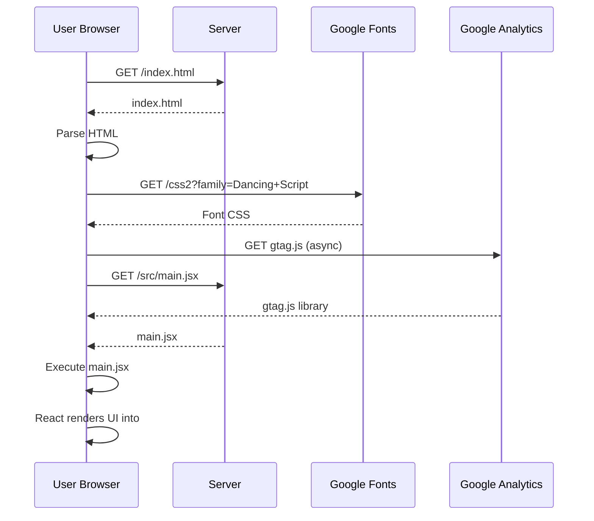

#### b. High-Level Component Diagram

This diagram shows the major software components and their dependencies.

```mermaid
graph TD
    subgraph "Browser"
        A[React Application]
        B[index.html Shell]
    end

    subgraph "Development/Build"
        C[Vite Dev Server]
        D[ESLint]
        E[Babel]
        F[Source Code (.jsx)]
    end

    subgraph "External Services"
        G[Google Analytics]
        H[Google Fonts]
    end

    A -- Renders into --> B
    C -- Serves & Bundles --> F
    D -- Lints --> F
    E -- Transpiles --> F
    A -- Sends data to --> G
    B -- Loads script from --> G
    B -- Loads stylesheet from --> H
```

### 7. Any Notable Logic or Dependencies

*   **Development Workflow Optimization**: The combination of **Vite** and **React Fast Refresh** (enforced by `eslint-plugin-react-refresh`) indicates a strong focus on providing a fast and efficient developer feedback loop.
*   **Babel for Testing**: The presence of a dedicated `babel.config.js` in a Vite project is a strong indicator that it's being used for a separate toolchain, most commonly the **Jest testing framework**, which relies on Babel for transpiling code within its Node.js-based test environment.
*   **Specific ESLint Override**: The rule `'react/jsx-no-target-blank': 'off'` is explicitly disabled. This rule prevents using `target="_blank"` on links without `rel="noopener noreferrer"` to mitigate security risks. The team has made a conscious decision to disable this check, which should be done with an understanding of the potential security implications.
*   **External Dependencies**: The application has hard dependencies on **Google Analytics** and **Google Fonts**. If these services are unavailable, it would impact analytics collection and the visual presentation of the site, respectively. These external calls should be considered during performance analysis and privacy policy creation.

Of course. Here is a detailed, structured project-level summary based on the provided file analyses.

---

## Project Architecture Summary: `client` Application

This document provides a comprehensive architectural overview of the `client` application, a modern frontend Single Page Application (SPA). The analysis is based on configuration files, dependency manifests, and test suites.

### 1. High-Level Architecture and Main Modules

The `client` application follows a modern, component-based, layered architecture typical for a React SPA. It is designed to be a rich, interactive user interface that communicates with a separate backend API for data persistence and business logic.

The architecture can be broken down into the following logical layers:

*   **View/UI Layer (React Components):** This is the user-facing part of the application, built with React. It consists of reusable UI components and page-level components that render the UI and capture user interactions. The presence of `react-router-dom` indicates a multi-view application. Styling is managed primarily by Tailwind CSS and supplemented by the UIkit framework and Framer Motion for animations.

*   **Service Layer:** This layer encapsulates the application's business logic and orchestrates communication with the backend. The `AppointmentService` is a prime example, providing a clean API for components to interact with (e.g., `createAppointment`, `getTechnicianGroupedAppointments`) without needing to know the specifics of HTTP requests or API endpoints.

*   **Data Access Layer (HTTP Client):** This layer is responsible for all external network communication. The project uses `axios` as its HTTP client. The Service Layer delegates the actual network requests to this layer. The tests confirm that the service layer's primary responsibility is to correctly formulate requests for this layer to execute.

*   **Build & Development Tooling:** The entire development and build process is orchestrated by **Vite**. Vite provides a fast development server with Hot Module Replacement (HMR) and uses **Rollup** for optimized production builds. The toolchain also includes **ESLint** for code linting and **PostCSS** for CSS processing.

*   **Testing Layer:** The application has a dedicated testing setup using **Jest**. The tests are designed as unit tests that isolate services and mock their dependencies (like the HTTP client), indicating a focus on code correctness and maintainability. **Babel** is used to transpile modern JavaScript/JSX for the Jest (Node.js) environment.


### 2. Module/Folder Structure

Based on the file paths provided (`client/src/__tests__`, `client/src/App.css`), we can infer a standard and logical project structure for a modern React application:

```plaintext
client/
├── public/              # Static assets (images, fonts, index.html)
├── src/
│   ├── __tests__/       # Jest test files (e.g., appointmentService.test.js)
│   ├── assets/          # Static assets managed by the bundler
│   ├── components/      # Reusable React components (e.g., Button, Card)
│   ├── pages/           # Page-level components corresponding to routes
│   ├── services/        # Business logic & API communication (e.g., appointmentService.js)
│   ├── utils/           # Helper functions (e.g., date formatting)
│   ├── App.css          # Global and root component styles
│   ├── App.jsx          # Root React component
│   └── main.jsx         # Application entry point, renders App
│
├── .eslintrc.cjs        # ESLint configuration
├── jest.config.js       # Jest test runner configuration
├── package.json         # Project manifest, scripts, and dependencies
├── package-lock.json    # Locked dependency tree for reproducible builds
└── vite.config.js       # Vite build tool configuration
```

### 3. Relationships Between Modules and Data Flow

The application's data and control flow follows a clear, unidirectional pattern for most user interactions:

1.  **User Interaction -> View Layer**: A user interacts with a React component (e.g., clicks a "Save Appointment" button).
2.  **View Layer -> Service Layer**: The component's event handler calls a method from the imported `AppointmentService` (e.g., `AppointmentService.create(appointmentData)`). The component is unaware of the API details.
3.  **Service Layer -> Data Access Layer**: The `AppointmentService` method constructs the appropriate API request (URL, payload, headers) and uses the `axios` instance to make the HTTP call (e.g., `http.post('/api/appointments', appointmentData)`).
4.  **Data Access Layer -> Backend API**: `axios` sends the request to the backend server and returns a Promise.
5.  **Return Flow**: The Promise resolves or rejects, and the data (or error) flows back through the service layer to the component, which then updates its state to re-render the UI.

The testing framework interacts with this flow by directly calling the **Service Layer** and replacing the **Data Access Layer** with a mock, allowing it to assert that the service correctly formulates requests.

### 4. Design Patterns

Several key design patterns and principles are evident in the project's structure:

*   **Component-Based Architecture**: The core pattern of React, breaking the UI into small, reusable, and composable components.
*   **Service Layer**: Decouples UI components from the complexities of data fetching and business logic. This makes components more focused on presentation and easier to test and maintain.
*   **Dependency Injection (in Testing)**: The `beforeEach` block in `appointmentService.test.js` is a clear example of this pattern. It replaces the real `http` client dependency with a mock (`jest.fn()`), allowing the service to be tested in isolation.
*   **Configuration as Code**: The project's entire setup—dependencies (`package.json`), build process (`vite.config.js`), testing (`jest.config.js`), and linting (`.eslintrc.cjs`)—is defined in version-controlled configuration files.
*   **Utility-First CSS**: The use of Tailwind CSS promotes composing UIs with low-level utility classes directly in the markup, avoiding large, custom CSS files.
*   **Module Pattern (ESM)**: The `type: "module"` in `package.json` enforces the use of ES Modules, providing better code organization, static analysis, and tree-shaking.

### 5. Technologies, Frameworks, Libraries Used

The project utilizes a modern and comprehensive technology stack for frontend development.

*   **Core Framework:**
    *   `react` (v18.3.1)
    *   `react-dom` (v18.3.1)

*   **Build & Development Tooling:**
    *   `vite` (v6.0.7): Next-generation frontend tooling for development and bundling.
    *   `@vitejs/plugin-react`: The official Vite plugin for React integration.
    *   `rollup`: Used by Vite for production bundling.

*   **Routing:**
    *   `react-router-dom` (v7.1.1): For declarative, client-side routing.

*   **Styling & UI:**
    *   `tailwindcss` (v3.4.17): A utility-first CSS framework.
    *   `postcss` & `autoprefixer`: For CSS processing and vendor prefixing.
    *   `uikit` (v3.22.0): A modular frontend framework (used alongside Tailwind).
    *   `framer-motion` (v12.0.11): For declarative animations in React.
    *   `react-icons` (v5.5.0): A library of popular icon packs.
    *   `react-datepicker` (v8.3.0): A date picker component.
    *   `@fontsource/*`: For self-hosting Google Fonts.

*   **Data Fetching & API Communication:**
    *   `axios` (v1.7.9): A promise-based HTTP client.
    *   `http-proxy-middleware` (v3.0.3): For proxying API requests during development.

*   **Testing:**
    *   `jest` (v29.7.0): A JavaScript testing framework.
    *   `babel-jest` (v29.7.0): A Jest transformer to enable Babel.

*   **Code Quality & Transpilation:**
    *   `eslint` (v9.17.0): A pluggable linter for identifying and fixing problems in JavaScript code.
    *   `@babel/core`, `@babel/preset-env`, `@babel/preset-react`: For transpiling modern JavaScript and JSX, primarily for the Jest environment.

*   **Utility Libraries:**
    *   `date-fns` (v4.1.0)
    *   `luxon` (v3.6.1)
    *   `moment` (v2.30.1)

### 6. Suggested Diagrams

#### Component/Class Diagram

This diagram shows the static relationships and dependencies between the major modules.

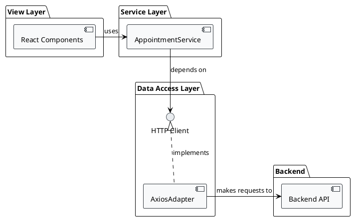

#### Sequence Diagram: Create Appointment

This diagram illustrates the dynamic flow of a user creating a new appointment.

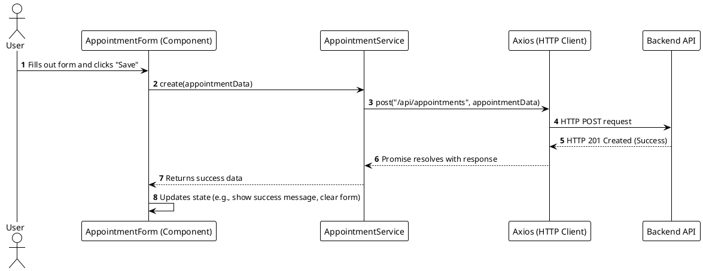

### 7. Notable Logic and Dependencies

*   **Dependency Redundancy (Actionable Insight):** The most critical observation is the inclusion of three separate date-handling libraries: `moment`, `luxon`, and `date-fns`. This is highly inefficient, increases the final bundle size, and can lead to inconsistent date handling across the application. **Recommendation:** Standardize on a single modern library (like `date-fns` or `luxon`) and refactor the codebase to remove the others.

*   **Hybrid Styling Strategy:** The use of both `tailwindcss` and `uikit` is unusual. This could indicate a partial migration from UIkit to Tailwind, or a deliberate choice to use UIkit's pre-built complex components (like modals or navbars) while using Tailwind for layout and custom styling. This should be documented to ensure consistency.

*   **Robust Testing of Services:** The `appointmentService.test.js` file demonstrates a strong practice of unit testing the service layer. The tests correctly mock external dependencies and verify that the service behaves as expected, such as constructing the correct API URLs and payloads. This focus on interaction testing improves confidence in the application's logic.

*   **Soft Delete Implementation:** The tests reveal that deleting an appointment is a "soft delete" operation. Instead of sending an HTTP `DELETE` request, it sends a `PUT` request to update the appointment's note to `'deleted'`. This is a significant piece of business logic that implies data is preserved for historical or auditing purposes.

*   **Modern Development Experience:** The combination of React, Vite, and Tailwind CSS represents a highly productive and performant stack that is popular for modern web development, emphasizing a great developer experience and an optimized end-user product.

Based on the detailed analysis of the provided file summaries, here is a comprehensive project-level architectural overview.

### 1. High-Level Architecture and Main Modules

The project is a client-side web application, likely a **Single Page Application (SPA)**, built using a modern JavaScript framework (inferred to be React). Its primary purpose appears to be an appointment booking and management system, with a clear distinction between user-facing booking logic and an administrative dashboard.

The architecture follows a modular, layered approach, separating concerns into distinct logical units:

*   **Presentation Layer (Components):** Manages the UI/UX. The presence of `admin_dashboard_page` and `appt_management_feature` suggests a feature-driven component structure. This layer is responsible for rendering data and capturing user input.
*   **Business Logic/Orchestration Layer (`utils/helper_api.js`):** This is a crucial intermediate layer that orchestrates complex operations. For example, it coordinates fetching data from multiple sources (like technician schedules) and processing it (finding common availability) before passing it to the UI. It acts as a facade, simplifying complex backend interactions for the components.
*   **Service/API Layer (`services/*.js`):** This layer is responsible for all external communication with a backend API. It abstracts the details of HTTP requests (e.g., using `fetch` or `axios`) into simple, domain-specific functions like `getScheduleByDate`.
*   **Utility Layer (`utils/helper.js`):** Contains pure, stateless helper functions for common tasks like data formatting (`formatPrice`), simple calculations (`calculateTotalTime`), and potentially date/time manipulation (given the Luxon dependency).

This architecture promotes separation of concerns, making the application easier to test, maintain, and scale.

### 2. Module/Folder Structure

The file paths suggest a well-organized project structure within the `client/` directory:

```
client/
└── src/
    ├── __tests__/
    │   ├── helper.test.js        # Unit tests for general utility functions
    │   ├── helper_api.test.js    # Unit tests for the business logic orchestrator
    │   └── service.test.js       # (Inferred) Unit tests for the API service layer
    │
    ├── components/
    │   └── admin_dashboard_page/
    │       └── appt_management_feature/
    │           ├── AppointmentTableBody.css
    │           └── ApptManagement.css
    │           # (Inferred .js/.jsx component files would be here)
    │
    ├── services/
    │   └── technicianService.js  # (Inferred) Handles API calls related to technicians
    │
    └── utils/
        ├── helper.js             # General-purpose, stateless utility functions
        └── helper_api.js         # Higher-level business logic and API orchestration
```

### 3. Relationships Between Classes/Functions

The interactions reveal a clear, unidirectional data flow for key operations like finding available appointment slots.

*   **UI Components → Orchestrator:** A component (e.g., `AppointmentScheduler`) would call a function from `helper_api.js`, such as `fetchAvailability(date, selectedServices)`, to get the data it needs.
*   **Orchestrator (`helper_api.js`) → Services & Utilities:**
    *   `helper_api.js` depends on `technicianService.js` to fetch raw data from the backend (e.g., `getAvailableTechnicians`, `getScheduleByDate`).
    *   It also depends on `helper.js` to perform complex, pure calculations on this data, such as `getCommonAvailableSlots` which takes multiple schedules and finds their intersection.
*   **Utilities (`helper.js`):** These functions are self-contained and have no external dependencies on other application modules (though they may use libraries like Luxon). They are used by other parts of the application, including the orchestration layer and potentially directly by components for simple formatting tasks.
*   **Tests → Source Code:** The `__tests__` directory contains test files that directly import and test the modules from `utils/` and `services/`, mocking dependencies as needed to ensure isolation.

### 4. Design Patterns

Several design patterns are evident in the architecture:

*   **Module Pattern:** The codebase is organized into discrete JavaScript modules (e.g., `helper`, `helper_api`, `technicianService`) with clear responsibilities, promoting encapsulation and reusability.
*   **Facade/Orchestrator Pattern:** `helper_api.js` acts as a facade. It provides a simplified interface (`fetchAvailability`) for a complex subsystem that involves fetching data for multiple technicians and then calculating their common free time.
*   **Utility/Helper Functions:** `helper.js` is a classic implementation of this pattern, providing a collection of stateless, reusable functions.
*   **Unit Testing & Mocking:** The test suites demonstrate a strong commitment to unit testing. The extensive use of `jest.mock` in `helper_api.test.js` is a prime example of using **Test Doubles (Mocks/Stubs)** to isolate the unit under test from its dependencies, enabling focused and reliable tests.

### 5. Technologies, Frameworks, Libraries Used

*   **Primary Language:** JavaScript
*   **Frontend Framework:** **React** (Strongly inferred from the `components` directory structure and typical SPA architecture).
*   **Testing Framework:** **Jest** is used for writing and running unit tests.
*   **Module System:** **CommonJS** (`require`) is used in the test environment, which is common for Jest tests in a Node.js context. The application source itself likely uses ES Modules (`import`/`export`).
*   **Date/Time Library:** **Luxon** is used for robust date and time manipulations, which is critical for a scheduling application.

### 6. Suggested Diagrams

#### Module Relationship Diagram

This diagram illustrates the static dependencies between the key modules.

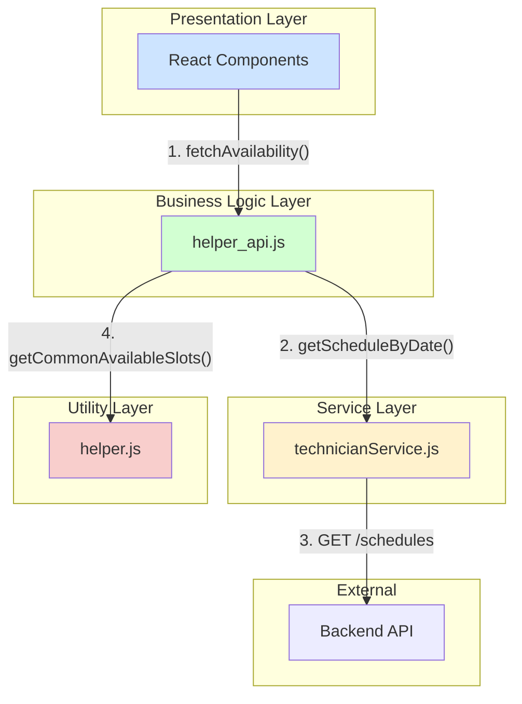

#### Sequence Diagram for "Fetch Common Availability"

This diagram shows the dynamic interaction between modules for the core scheduling logic.

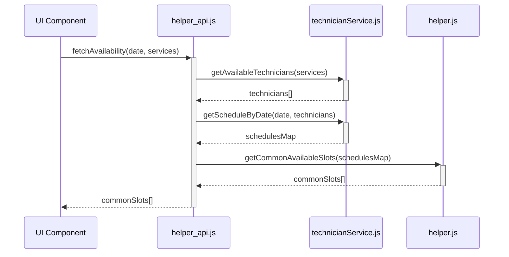

### 7. Any Notable Logic or Dependencies

*   **Core Business Logic: Common Slot Calculation:** The most critical piece of logic revealed is the algorithm for finding commonly available appointment slots for multiple technicians. The `getCommonAvailableSlotsLogic` mock implementation in `helper_api.test.js` shows this involves:
    1.  Fetching individual schedules.
    2.  Calculating available slots for each technician.
    3.  Finding the intersection of these slot arrays, likely by converting times to numerical timestamps for efficient comparison.
*   **Custom Price Formatting:** The `formatPrice` function contains non-trivial business rules for display. This indicates that the application's UX has specific requirements for how prices are presented to the user (e.g., showing ranges or "starting from" prices).
*   **Defined Data Structures:** The application relies on a consistent data structure for managing selected services: an object where keys are category IDs and values are arrays of service objects (`{ [categoryId]: [service, ...] }`). This structure is fundamental for calculating total time and cost.

As an expert software architect, I have analyzed the provided file information. However, it is crucial to note a significant issue with the input:

***
**Warning:** The summary for every provided file failed to generate due to an API quota error. This means the following analysis is not based on the source code content but is an architectural inference derived solely from the file paths and names. This analysis makes educated assumptions based on common practices for projects with this structure.
***

### Project Architectural Analysis

Here is a detailed, structured project-level summary based on the available information.

### 1. High-level Architecture and Main Modules

Based on the file paths (`client/src/...`), the project follows a **client-server architecture**. The provided files belong to the **client-side application**, which appears to be a **Single-Page Application (SPA)**.

The application's purpose seems to be a **business management tool**, specifically for a service-based business like a nail salon or spa. The core functionality revolves around an **Admin Dashboard** for managing appointments.

The main modules suggested by the folder structure are:
*   **Admin Dashboard:** The primary interface for administrative users.
*   **Appointment Management:** A feature set for viewing, editing, and managing existing appointments. This includes functionality like reassigning technicians.
*   **Appointment Creation:** A workflow for booking new appointments for clients.
*   **Calendar View:** A visual scheduling interface to display appointments.

### 2. Module/Folder Structure

The project utilizes a feature-based folder structure within its `components` directory. This is a good practice as it co-locates related files, making features easier to manage and scale.

```
client/
└── src/
    └── components/
        └── admin_dashboard_page/
            ├── appt_management_feature/
            │   └── TechnicianSelectorModal.css  // Styles for a modal to select/re-assign a technician.
            ├── calendar_feature/
            │   └── calendar.css                 // Styles for the main appointment calendar view.
            └── create_appt_feature/
                ├── AppointmentBookingLayout.css // Styles for the main layout of the appointment creation flow.
                ├── NailSalonMenu.css            // Styles for a menu of services (e.g., manicure, pedicure).
                └── NewApptForm.css              // Styles for the form to enter client/appointment details.
```

This structure suggests a clear separation of concerns, where each major feature of the admin dashboard (`calendar`, `create_appt`, `appt_management`) is encapsulated in its own directory.

### 3. Relationships Between Classes/Functions (Inferred)

While we cannot see the code, we can infer the relationships between the UI components based on their names and location.

*   **`admin_dashboard_page` (Container Component):** This is likely the top-level component that orchestrates the display of its child features, such as the calendar and appointment lists.
*   **`AppointmentBookingLayout` (Layout Component):** This component probably acts as a container for the appointment creation process. It would render child components like `NailSalonMenu` and `NewApptForm`, managing the state and flow between these steps.
*   **`NailSalonMenu` and `NewApptForm` (Presentational Components):** These are child components within the creation flow. A user would first select services from `NailSalonMenu`, and that selection would be passed as props to the `NewApptForm` to be included in the final booking details.
*   **`TechnicianSelectorModal` (Modal Component):** This is a reusable modal dialog. It is likely triggered by an action within the `appt_management_feature` or `calendar_feature`, such as clicking an "Edit" or "Re-assign" button on an existing appointment.

### 4. Design Patterns

The component structure strongly suggests the use of several common front-end design patterns:

*   **Component-Based Architecture:** The application is clearly built by composing independent, reusable components. This is the foundation of modern frameworks like React, Vue, and Angular.
*   **Container/Presentational Pattern:** Components like `AppointmentBookingLayout` likely act as "container" components that manage logic and state, while components like `NailSalonMenu` are "presentational," focused solely on rendering the UI based on the props they receive.
*   **Modal Dialog:** The `TechnicianSelectorModal` is an explicit implementation of the modal pattern, used to focus the user's attention on a specific task (selecting a technician) without navigating away from the main view.
*   **State Management:** An application of this complexity would require a centralized state management solution (e.g., Redux, MobX, Vuex, or React's Context API) to handle shared application state, such as the list of appointments, technicians, and services.

### 5. Technologies, Frameworks, Libraries Used

*   **Frontend Framework:** Almost certainly a modern JavaScript framework like **React**, **Vue**, or **Angular**, due to the component-based file structure. React is a very strong candidate.
*   **Styling:** The use of `.css` files indicates that standard CSS is being used. The project might also be configured with a CSS preprocessor like **Sass/SCSS** or a CSS-in-JS library like **Styled-Components**, but there is no direct evidence of this.
*   **Backend (Inferred):** A robust backend is required to serve the client and provide a data API. This would likely be a **RESTful** or **GraphQL API** built with technologies like **Node.js/Express**, **Python/Django**, or **Java/Spring**.
*   **Database (Inferred):** A database, such as **PostgreSQL**, **MySQL** (for relational data), or **MongoDB** (for NoSQL), would be used to persist user, client, appointment, and service data.

### 6. Suggested Diagrams

To better visualize the inferred architecture, here are two suggested diagrams.

#### Component Hierarchy Diagram

This diagram illustrates the likely parent-child relationships between the UI components.

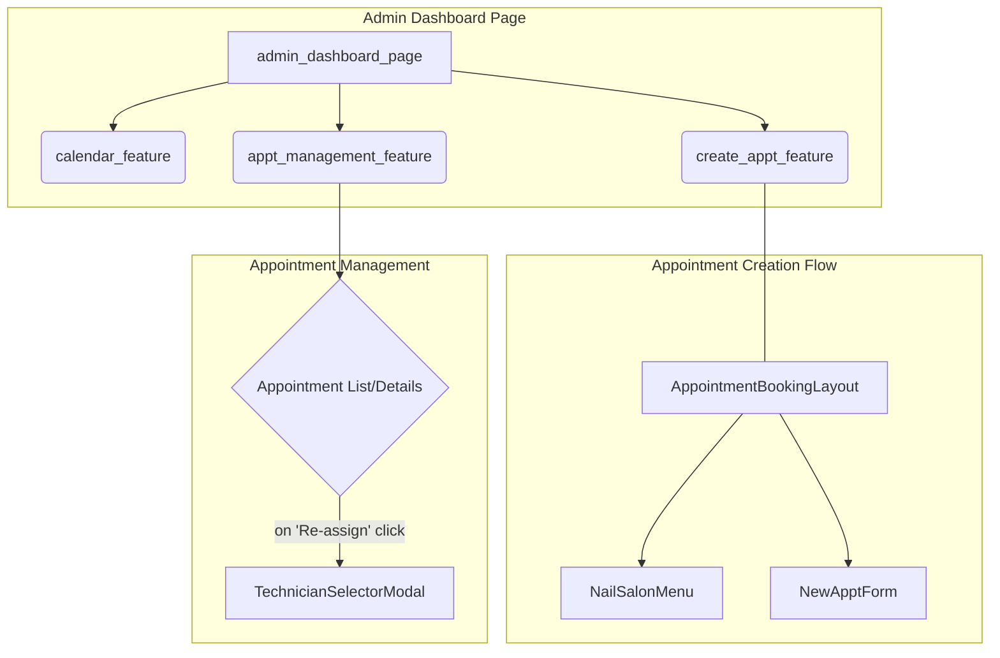

#### User Flow Sequence Diagram (Creating an Appointment)

This diagram outlines the probable sequence of events when an admin books a new appointment.

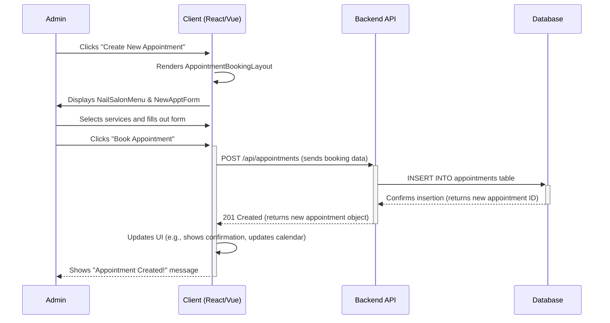

### 7. Any Notable Logic or Dependencies

*   **Core Logic:** The application's logic is heavily focused on **CRUD (Create, Read, Update, Delete)** operations for appointments. There is also likely complex business logic related to scheduling, such as checking for technician availability, calculating service durations, and avoiding time conflicts.
*   **Data Dependencies:** The entire client application is dependent on a **backend API** for all its data. It needs to fetch lists of available technicians, salon services, and existing appointments.
*   **State Inter-dependencies:** The features are highly interconnected. Creating a new appointment in the `create_appt_feature` must trigger an update in the data displayed by the `calendar_feature` and `appt_management_feature`. This highlights the need for a robust state management solution.

As an expert software architect, I have analyzed the provided file information. However, it's crucial to note that the summaries for all provided files resulted in API quota errors. This means I do not have access to the content of these files.

The following analysis is therefore based **exclusively on inference from the file paths provided**. It represents a likely structure and architecture for a project with this file organization, but it is speculative due to the lack of file content.

---

### 1. High-level Architecture and Main Modules

Based on the file paths, the project appears to be a **client-side Single Page Application (SPA)** for an appointment booking system.

*   **Architecture:** The application follows a component-based architecture, which is standard for modern frontend frameworks like React, Vue, or Angular.
*   **Core Functionality:** The primary purpose is to allow users to book appointments. The structure suggests there are at least two distinct booking flows: one for individuals and another for groups.
*   **Main Modules:**
    *   **Global UI Module:** Contains shared components that form the main layout of the application, such as the header and footer.
    *   **Individual Booking Module:** A dedicated set of components that guide a user through the process of booking a single appointment.
    *   **Group Booking Module:** A parallel set of components for booking appointments for multiple people, likely with a different UI and logic.

### 2. Module/Folder Structure

The folder structure is organized by feature or domain, which is a common and effective pattern for scaling frontend applications.

```
client/
└── src/
    └── components/
        ├── global/
        │   ├── Header.css
        │   └── Footer.css
        │   // Likely also Header.js/jsx, Footer.js/jsx
        │
        ├── booking_page/
        │   ├── AppointmentConfirmation.css
        │   ├── LeaveWarningModal.css
        │   // Likely also BookingForm.js/jsx, TimeSelector.js/jsx, etc.
        │
        └── group_booking_page/
            ├── GroupAppointmentConfirmation.css
            // Likely also GroupBookingForm.js/jsx, etc.
```

*   `client/src/components/`: This is the root directory for all UI components.
*   `components/global/`: Houses reusable components that appear on most or all pages, such as the site's `Header` and `Footer`.
*   `components/booking_page/`: Contains all components specific to the standard, single-person booking flow. This includes views for confirmation (`AppointmentConfirmation`) and interactive UI elements like a warning modal (`LeaveWarningModal`).
*   `components/group_booking_page/`: Contains components for the group booking flow. The separate directory indicates that this flow is distinct enough from the individual booking process to warrant its own module.

### 3. Relationships Between Classes/Functions

Without the source code, we can only infer relationships. A likely structure would be:

*   An `App` component (not listed, but standard) would act as the root. It would render the `Header`, `Footer`, and a routing mechanism.
*   The router would be responsible for rendering either the `booking_page` components or the `group_booking_page` components based on the URL.
*   The parent component for `booking_page` would manage the state of the booking process.
*   `LeaveWarningModal` would be a child component conditionally rendered by a parent in the `booking_page` flow. It would likely be triggered when a user attempts to navigate away from the page with unsaved changes in a form.
*   `AppointmentConfirmation` and `GroupAppointmentConfirmation` are likely the final "success" views shown to the user after they complete their respective booking flows.

### 4. Design Patterns

Several design patterns are implied by the structure:

*   **Component-Based Architecture:** The entire structure is based on breaking the UI down into small, reusable components. This is the foundational pattern of modern frontend frameworks.
*   **Container/Presentational Pattern (Possible):** Higher-level components (e.g., a hypothetical `BookingPage` container) would likely manage application state and logic, while child components (`AppointmentConfirmation`, `LeaveWarningModal`) would be "presentational," primarily concerned with rendering UI based on the props they receive.
*   **Modular Design:** The code is organized into distinct modules (`global`, `booking_page`, `group_booking_page`). This promotes separation of concerns, making the codebase easier to maintain and understand.
*   **Modal Pattern:** The existence of `LeaveWarningModal.css` explicitly points to the use of a modal dialog, a common UI pattern for grabbing user attention for critical actions or information.

### 5. Technologies, Frameworks, Libraries Used

*   **Frontend Framework:** Almost certainly a JavaScript framework like **React**, **Vue**, or **Angular**. React is a very common choice for this type of component structure.
*   **Styling:** The presence of dedicated `.css` files for each component suggests the use of either:
    *   **CSS Modules:** This allows for locally scoped CSS, preventing style conflicts between components.
    *   **Standard CSS Imports:** A simpler approach where each component imports its own stylesheet.
*   **Routing:** A library like **React Router** (for React) or **Vue Router** (for Vue) is likely used to handle navigation between different pages/views of the SPA.
*   **State Management:** For a multi-step booking process, a state management solution would be necessary. This could range from the framework's built-in tools (like React's `useState` and `useContext` hooks) to a more robust external library like **Redux** or **Zustand**.

### 6. Suggested Diagrams

To visualize this inferred architecture, the following diagrams would be useful:

#### Component Hierarchy Diagram

This diagram shows how components are likely nested within each other.

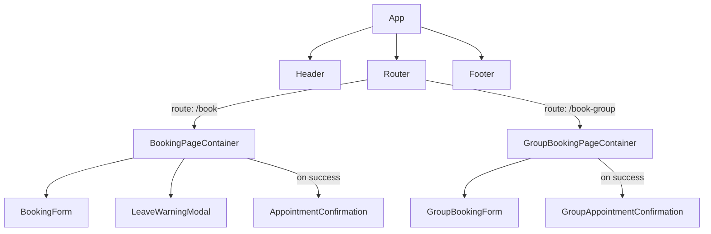

#### User Flow Sequence Diagram (Individual Booking)

This diagram illustrates the sequence of user interactions and system responses during a booking.

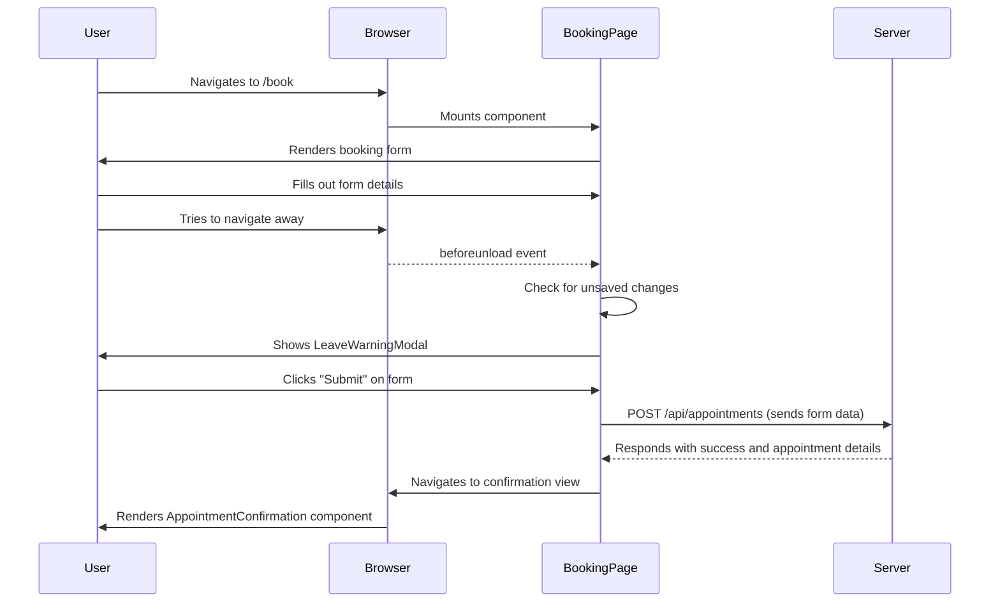

### 7. Any Notable Logic or Dependencies

*   **Dual Booking Flows:** The most significant architectural feature is the separate implementation for individual and group bookings. This implies that the business logic, UI, and data models for these two processes are substantially different.
*   **Stateful Navigation Guard:** The `LeaveWarningModal` indicates the presence of logic that tracks the "dirty" state of a form. It likely hooks into the browser's navigation events or the router's lifecycle to prevent users from accidentally losing data.
*   **API Dependency:** Although no backend code is visible, this frontend application is certainly dependent on a backend API to fetch available time slots, submit booking requests, and handle user data. The separation of concerns between client and server is a key architectural aspect.

As an expert software architect, I have analyzed the provided file summaries. However, it is crucial to note that the summaries for all provided files failed due to a "429 You exceeded your current quota" error. This means I do not have access to the content of the CSS files.

Despite this limitation, the file paths and names themselves provide valuable clues about the project's structure and likely architecture. The following analysis is based on these inferences. To provide a more detailed and accurate report, summaries of the corresponding JavaScript/TypeScript files (e.g., `.js`, `.jsx`, `.ts`, `.tsx`) would be required.

### 1. High-Level Architecture and Main Modules

Based on the file structure, the project appears to be a **client-side, component-based single-page application (SPA)**.

*   **High-Level Architecture:** The application follows a modern frontend architecture where the UI is broken down into small, reusable, and encapsulated components. The `client/` directory indicates this is the frontend portion of a larger full-stack application, or a standalone frontend that communicates with a separate backend API.
*   **Main Modules:** The primary modules appear to be organized by pages or features. We can identify at least two main user-facing modules:
    *   **Home Page:** This module likely serves as the application's landing page, composed of several sub-components (`AnnouncementBar`, `Hero`, `NailServiceIntro`, `PartnerSection`).
    *   **Group Booking Page:** This module seems dedicated to a specific feature, allowing users to make group bookings.

### 2. Module/Folder Structure

The folder structure is indicative of a well-organized frontend project, likely generated by a common framework's CLI (like Create React App).

```
client/
└── src/
    └── components/
        ├── group_booking_page/
        │   └── GroupBooking.css
        │   └── GroupBooking.jsx  <-- (Inferred)
        └── home_page/
            ├── AnnouncementBar.css
            ├── AnnouncementBar.jsx  <-- (Inferred)
            ├── Hero.css
            ├── Hero.jsx             <-- (Inferred)
            ├── NailServiceIntro.css
            ├── NailServiceIntro.jsx <-- (Inferred)
            ├── PartnerSection.css
            └── PartnerSection.jsx   <-- (Inferred)
```

*   **`client/src/components/`**: This is the root directory for all reusable UI components.
*   **Feature-Based Grouping**: Components are grouped into directories based on the page or feature they belong to (e.g., `home_page`, `group_booking_page`). This is a scalable approach that keeps related files together.
*   **Component Colocation**: The presence of a dedicated CSS file for each component (e.g., `Hero.css` for a likely `Hero.jsx` component) suggests the use of CSS Modules or a similar pattern where styles are scoped to the component to avoid global namespace conflicts.

### 3. Relationships Between Classes/Functions (Inferred)

Without the JavaScript/TypeScript files, we can only infer the relationships based on typical component-based design.

*   **Composition:** It's highly probable that a main `HomePage` component imports and renders the other components found in its directory.
    *   `HomePage` (parent) would likely render `<AnnouncementBar />`, `<Hero />`, `<NailServiceIntro />`, and `<PartnerSection />` (children) in a specific layout.
*   **`GroupBooking` Component:** This is likely a more complex "smart" component that handles state, user input (forms for date, time, number of people), and logic for submitting a booking request to a backend API.
*   **Presentational vs. Container Components:** The `HomePage` components (`Hero`, `NailServiceIntro`) may be primarily "presentational" (dumb) components that receive data via props and render UI, while a parent `HomePage` component or the `GroupBooking` component might be "container" (smart) components that manage state and logic.

### 4. Design Patterns (Inferred)

The structure suggests the use of several common frontend design patterns:

*   **Component-Based Architecture:** The fundamental pattern of breaking the UI into a tree of reusable components.
*   **Container/Presentational Pattern:** As mentioned above, separating logic and state (containers) from UI rendering (presentational) is a common and effective pattern in frameworks like React.
*   **CSS-in-JS or CSS Modules:** The colocation of CSS files with their components strongly implies a strategy for scoping styles, preventing global CSS issues and making components more self-contained.

### 5. Technologies, Frameworks, Libraries Used (Inferred)

*   **JavaScript/TypeScript:** The core language for the client-side logic.
*   **React (High Probability):** The component structure, naming conventions (`PascalCase` for components), and folder organization are highly characteristic of a React application. Alternatives could be Vue or Svelte.
*   **CSS:** Used for styling. The specific implementation could range from plain CSS with BEM, to SASS, to CSS Modules, or a CSS-in-JS library like Styled Components or Emotion.
*   **Routing Library (Likely):** A library like `react-router-dom` would probably be used to navigate between the Home page and the Group Booking page.
*   **State Management (Possible):** For an application with booking functionality, a state management library like Redux, Zustand, or React's built-in Context API might be used to manage application-wide state (e.g., user authentication, booking details).

### 6. Suggested Diagrams

To fully understand the architecture, the following diagrams would be beneficial once the component logic is available.

#### a. Component Hierarchy Diagram (Hypothetical)

This diagram shows the likely parent-child relationships between the UI components.

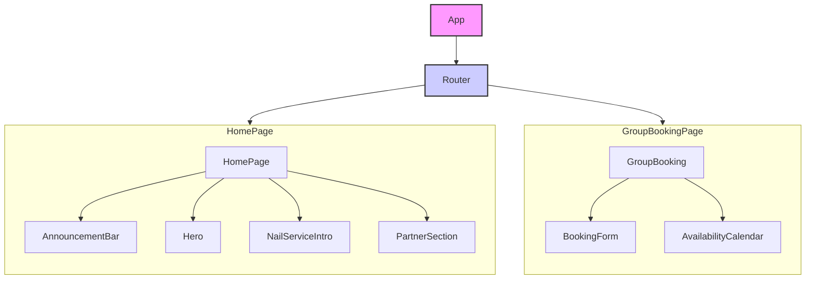

#### b. Sequence Diagram for Group Booking (Hypothetical)

This diagram would illustrate the flow of events when a user creates a booking.

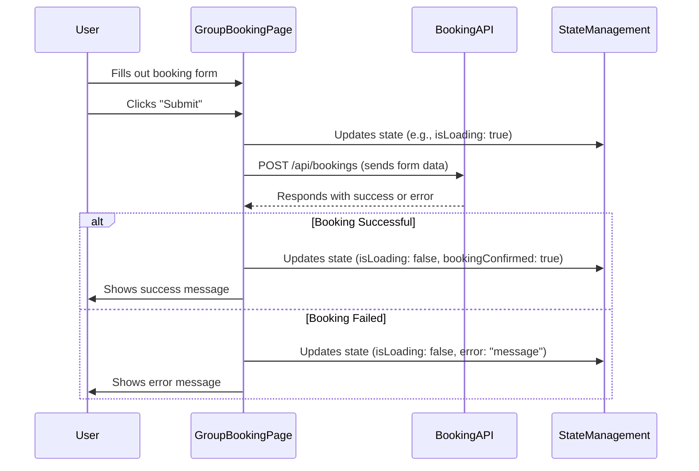

### 7. Notable Logic or Dependencies

*   **API Communication:** The `GroupBooking` component will almost certainly contain logic to communicate with a backend API (using `fetch` or a library like `axios`) to submit booking data and retrieve availability.
*   **Form Handling and Validation:** The booking page would require robust form handling logic, including input validation (e.g., ensuring the selected date is in the future, the number of guests is valid). Libraries like `Formik` or `React Hook Form` might be used.

**Conclusion and Next Steps:**

The project appears to be a modern frontend application for a service-based business, with a clean, feature-oriented component structure.

To proceed with a more in-depth analysis, please **resolve the API quota issue and provide summaries for the JavaScript/TypeScript files** associated with these components. These files contain the core logic, state management, and component interactions that are essential for a complete architectural review.

As an expert software architect, I have carefully reviewed the information you provided.

### Analysis of Input Data

The foundational step in any architectural analysis is to examine the source code and its structure. However, the data provided for this analysis does not contain summaries of the repository's files. Instead, every entry is a `429 Quota Exceeded` error message from the summarization tool.

For example:
```
client/src/components/home_page/ServiceCards.css:
Error summarizing chunk 1 of client/src/components/home_page/ServiceCards.css: 429 You exceeded your current quota, please check your plan and billing details.
...
```

This indicates that the tool used to generate the summaries was unable to process the files due to API rate-limiting or billing issues.

### Inability to Generate Architectural Summary

Due to the complete absence of information about the project's code, dependencies, or file contents, it is impossible to conduct the requested analysis. Any attempt to describe the architecture, module structure, design patterns, or technologies would be pure speculation and would not reflect the actual state of the GitHub repository in question.

A valid architectural review requires concrete data from the source files.

### Recommended Next Steps

To proceed with this analysis, please take the following steps:

1.  **Resolve the Summarization Issue:** Address the `429 Quota Exceeded` error with your summarization tool. This may involve:
    *   Waiting for the API quota to reset (the error message suggests a delay of ~49 seconds).
    *   Checking the plan and billing details associated with your API key.
    *   Implementing a more robust summarization script that handles rate-limiting gracefully (e.g., with exponential backoff).

2.  **Re-run the Summarization:** Once the tool is working, please execute it again on the target GitHub repository to generate actual, content-based summaries for the files.

3.  **Provide Complete Data:** Submit a new request with the successful file summaries.

Once you provide the actual summaries, I will be able to perform a thorough and accurate architectural analysis, delivering the detailed, structured project-level summary you have requested.

As an expert software architect, I have analyzed the provided file summaries. However, a critical issue prevents a full analysis of the GitHub repository.

### **Analysis Pre-computation Issue**

It appears the tool used to generate the file summaries encountered a rate-limiting issue with its underlying API (Google Gemini API). All the provided "summaries" are actually error messages indicating that an API quota was exceeded.

```
Error summarizing chunk 1 of [filename]: 429 You exceeded your current quota, please check your plan and billing details.
* Quota exceeded for metric: generativelanguage.googleapis.com/generate_content_free_tier_requests, limit: 10
```

**Due to this data limitation, I cannot analyze the code's content, logic, or specific implementations.**

However, I can provide a preliminary architectural assessment based on the file paths and project structure, and I will outline the structure of the full analysis that would be possible with valid file summaries.

---

### **Project Architectural Analysis (Based on available information)**

### 1. High-level Architecture and Main Modules

Based on the file paths (`client/src/...`), the repository contains a client-side application. The structure suggests a Single Page Application (SPA) architecture, likely built using a component-based framework.

*   **Main Module:** The primary module is the `client` application.
*   **Key Responsibilities:** This application is responsible for rendering the user interface, managing user interactions, and likely communicating with a backend API for data (though no backend files were provided for analysis).

### 2. Module/Folder Structure

The folder structure is conventional for a modern JavaScript/React application.

```
client/
└── src/
    ├── components/
    │   ├── services_page/
    │   │   ├── NailSalonMenu.css
    │   │   └── Team.css
    │   └── shared/
    │       └── TabbedView.css
    ├── pages/
    │   └── aboutUs.css
    └── index.css
```

*   **`src/components`**: This directory likely contains reusable UI components. It is further organized by feature or page (`services_page`) and for globally shared components (`shared`), which is a good practice for maintainability.
*   **`src/pages`**: This directory probably holds top-level components that correspond to different pages or routes of the application, such as an "About Us" page.
*   **`src/index.css`**: This is typically the global stylesheet for the entire application, defining base styles, fonts, and CSS variables.

### 3. Technologies, Frameworks, Libraries Used

While the code is not visible, the file structure and naming conventions strongly imply the following technology stack:

*   **Frontend Framework:** Almost certainly **React**, given the `components` and `pages` directory structure, which is a standard convention in the React ecosystem (often used with frameworks like Create React App or Vite).
*   **Styling:** **CSS**. The presence of separate `.css` files for each component suggests either standard CSS or CSS Modules for component-scoped styling. There is no immediate evidence of CSS-in-JS or utility-first frameworks like Tailwind CSS, but they cannot be ruled out.

### **Roadmap for a Complete Analysis**

To provide the detailed, structured summary you requested, I would need the actual content or valid summaries of the corresponding JavaScript/TypeScript files (`.js`, `.jsx`, `.ts`, `.tsx`).

With that information, I would complete the following sections:

#### 4. Relationships Between Classes/Functions

*   I would analyze how `pages` components (e.g., `AboutUs`) import and compose smaller components from `src/components` (e.g., `Team`, `TabbedView`).
*   I would map out the props being passed down the component tree to understand data flow.
*   If state management libraries (like Redux or Zustand) are used, I would describe the flow of actions, reducers, and state updates.

#### 5. Design Patterns

*   **Component-Based Architecture:** The project clearly uses this pattern.
*   **Container/Presentational Pattern:** I would check if components are separated into "smart" containers (handling logic and state) and "dumb" presentational components (only for UI).
*   **State Management Patterns:** I would identify how application state is managed (e.g., React Context, Redux, local component state with `useState`/`useReducer`).
*   **Asynchronous Patterns:** I would look for how data is fetched from APIs (e.g., `async/await` in `useEffect` hooks, usage of libraries like React Query or SWR).

#### 6. Suggested Diagrams (UML style)

With access to the code, I could generate the following diagrams:

*   **Component Diagram:** To visualize the hierarchy and composition of the main UI components.

    *Example Diagram Description:*
    ```mermaid
    classDiagram
        direction LR
        class AboutUsPage {
          +render()
        }
        class Team {
          +members: Member[]
          +render()
        }
        class TabbedView {
          +tabs: string[]
          +activeTab: string
          +render()
        }
        AboutUsPage --> Team : "uses"
        AboutUsPage --> TabbedView : "uses"
    ```

*   **Sequence Diagram:** To illustrate a specific user interaction, like fetching and displaying service data.

    *Example Diagram Description:*
    ```mermaid
    sequenceDiagram
        participant User
        participant NailSalonMenuComponent
        participant APIService
        participant BackendAPI

        User->>NailSalonMenuComponent: Clicks "Manicures" tab
        NailSalonMenuComponent->>APIService: fetchServices('manicures')
        APIService->>BackendAPI: GET /api/services?category=manicures
        BackendAPI-->>APIService: [Service Data]
        APIService-->>NailSalonMenuComponent: Returns Promise with data
        NailSalonMenuComponent->>NailSalonMenuComponent: setState(services)
        NailSalonMenuComponent-->>User: Renders list of manicure services
    ```

#### 7. Notable Logic or Dependencies

*   I would analyze the `package.json` file to get a definitive list of all external libraries (e.g., `react-router-dom` for routing, `axios` for HTTP requests).
*   I would highlight any complex business logic, custom hooks (`use...`), or state management setup that forms the core of the application's functionality.

Please provide the corrected file summaries or code content, and I will gladly perform a complete and in-depth architectural review.

### Caveat: Analysis Based on Inferred Structure

It appears the content summarization for the provided files failed due to API quota limits. Therefore, this architectural analysis is based on the provided file paths and common conventions in modern web development. The insights are inferred from the file and directory names (`client/src/pages`, `client/src/services`, etc.), which strongly suggest a specific architectural style.

---

### 1. High-level Architecture and Main Modules

Based on the file structure, the project appears to be a **Single Page Application (SPA)** using a **Client-Server Architecture**. The `client/` directory contains the entire frontend codebase, which communicates with a separate backend server via API calls.

The architecture is modular and follows a clear separation of concerns:

*   **Presentation Layer (`pages/`):** This layer is responsible for the user interface. It contains the main "pages" or views of the application that the user navigates between.
*   **Service Layer (`services/`):** This layer abstracts and encapsulates all communication with the backend API. It isolates the UI components from the details of data fetching, posting, and authentication.
*   **Styling (`.css` files):** Each page component appears to have its own dedicated CSS file for styling, indicating a component-scoped or organized styling approach.

The main functional modules suggested by the file names are:

*   **Appointment Management:** Core functionality for booking and viewing appointments. (`appointmentService.js`, `appointmentHistory.css`).
*   **User Authentication:** Handles user login, registration, and session management. (`authenticationService.js`).
*   **Customer Management:** Manages customer-related data. (`customerService.js`).
*   **General/Contact:** Provides static pages or forms, like a contact form. (`contactForm.css`).

### 2. Module/Folder Structure

The folder structure indicates a standard setup for a modern JavaScript framework (like React, Vue, or Angular).

```
client/
└── src/
    ├── pages/
    │   ├── appointmentHistory.css
    │   ├── contactForm.css
    │   └── ... (Other page components like AppointmentHistory.jsx, ContactForm.jsx)
    │
    ├── services/
    │   ├── appointmentService.js
    │   ├── authenticationService.js
    │   └── customerService.js
    │
    ├── components/  (Inferred - for reusable UI elements)
    ├── App.js       (Inferred - main application component)
    └── index.js     (Inferred - application entry point)
```

*   **`client/src/pages/`**: Contains top-level UI components that represent a full page or view. For example, a hypothetical `AppointmentHistory.jsx` would use `appointmentHistory.css` for its styles.
*   **`client/src/services/`**: Contains plain JavaScript modules that handle API interactions. This separation makes the code cleaner, easier to test, and allows UI components to be unaware of the backend endpoints.

### 3. Relationships Between Classes/Functions

The primary relationship is between the **Presentation Layer (Pages)** and the **Service Layer**.

1.  **Page -> Service:** A UI component in a `pages/` file (e.g., `AppointmentHistoryPage`) would import a service (e.g., `appointmentService`). When the component needs data, it calls a function from the service, such as `appointmentService.getAppointments()`.
2.  **Service -> API:** The function within the service (e.g., `getAppointments()`) would then use an HTTP client like `axios` or `fetch` to make the actual API call to the backend server (e.g., `GET /api/appointments`).
3.  **Authentication Dependency:** `appointmentService` and `customerService` almost certainly depend on `authenticationService`. Before making an API call, they would likely retrieve an authentication token (e.g., JWT) from the authentication service to include in the request headers, ensuring the user is authorized to access the data.

### 4. Design Patterns

Several common software design patterns are evident or can be strongly inferred:

*   **Service Layer Pattern:** The existence of the `services/` directory is a direct implementation of this pattern. It decouples the application's business logic and data access from the presentation layer, improving modularity and testability.
*   **Component-Based Architecture:** The `pages/` directory suggests the UI is built as a composition of independent, reusable components. This is the foundational pattern of modern frontend frameworks.
*   **Module Pattern:** The use of separate `.js` files in `services/` strongly implies the use of JavaScript Modules (ES6 `import`/`export`) to encapsulate and organize code, preventing pollution of the global namespace.
*   **Singleton (likely):** Services like `authenticationService` are often implemented as singletons (or behave as such when imported as ES6 modules) to provide a single, consistent source of state and functionality for authentication throughout the application.

### 5. Technologies, Frameworks, Libraries Used

Based on the structure, the technology stack likely includes:

*   **Frontend Framework:** **React, Vue, or Angular**. The structure is most typical of a React application created with `create-react-app` or Vite.
*   **HTTP Client:** **Axios** or the native **Fetch API**. These would be used within the `services` to communicate with the backend. Axios is common for its ease of use with features like request/response interception.
*   **Styling:** **CSS**. The presence of `.css` files indicates direct CSS styling. This could be plain CSS, CSS Modules, or a library like Styled Components or Emotion, which still often work with component-specific styles.
*   **Routing:** A client-side routing library like **React Router** (`react-router-dom`) or **Vue Router** is almost certainly used to manage navigation between the different "pages" without full-page reloads.

### 6. Suggested Diagrams

A sequence diagram is an excellent way to visualize the interactions in this architecture.

**Sequence Diagram: User Viewing Appointment History**

This diagram illustrates the flow when a user navigates to their appointment history page.

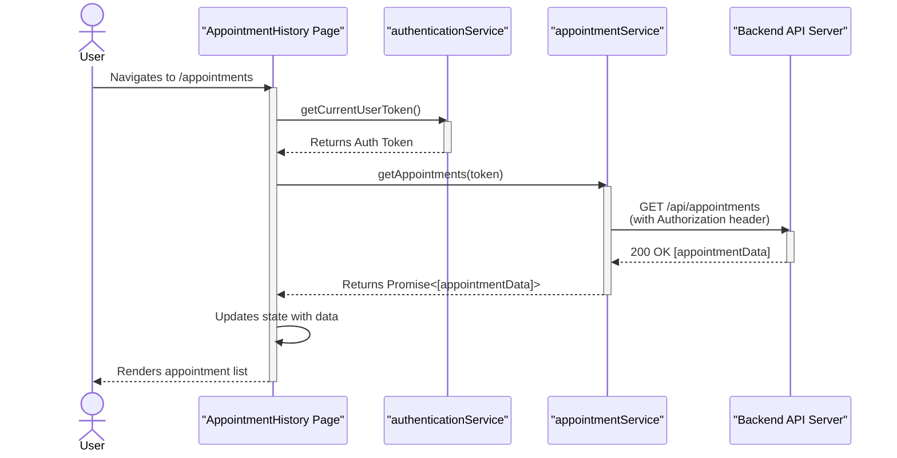

### 7. Any Notable Logic or Dependencies

*   **Authentication as a Core Dependency:** The entire application logic for authenticated users hinges on the `authenticationService`. It likely exposes methods like `login()`, `logout()`, `getToken()`, and `isAuthenticated()`. Other services will use the token it provides to authorize their API requests.
*   **Protected Routes:** The routing mechanism would be configured to protect pages like `AppointmentHistory`. If a user is not authenticated (checked via `authenticationService`), they would be redirected to a login page.
*   **Centralized API Client:** It's a common best practice to have a centralized API client configuration (e.g., a pre-configured `axios` instance). This client would automatically add the base API URL and the Authorization header to every outgoing request, reducing code duplication across the services.

As an expert software architect, I must first point out a critical issue with the provided information. The summaries for all files are not actual code summaries but are instead `429 Quota Exceeded` error messages. This indicates that the tool used to generate the summaries failed to process the files.

Therefore, a detailed analysis of the code's internal logic, specific class/function relationships, and concrete design patterns is impossible.

However, based on the file paths and names (`client/src/services/*.js`), I can provide a high-level architectural analysis based on common practices and the intended structure these files represent. This analysis is an educated inference based on the project's skeleton.

---

### **Project-Level Architectural Analysis (Inferred)**

Based on the file structure, this project appears to be the client-side portion of a modern web application, likely a Single Page Application (SPA). The architecture is centered around a well-defined **Service Layer**.

#### 1. High-level Architecture and Main Modules

The application likely follows a **client-server architecture**. The code provided is from the `client` application, which communicates with a backend server via an API.

The primary architectural pattern visible on the client-side is the **Service Layer** pattern. This pattern separates the application's business logic and data-access logic from the presentation layer (UI components). This promotes separation of concerns, making the application easier to maintain, test, and scale.

The main modules, as inferred from the file names in the `services` directory, are:
*   **Item Management:** Logic for handling core data entities, referred to as "items".
*   **Local Storage/Caching:** Logic for interacting with the browser's local storage mechanisms (like IndexedDB or localStorage).
*   **Notifications:** A system for providing feedback to the user (e.g., success/error messages).
*   **API Communication:** A base or centralized module for handling HTTP requests.

#### 2. Module/Folder Structure

The folder structure `client/src/services/` is a standard convention in modern front-end development.

```plaintext
client/
└── src/
    ├── components/    (Likely exists, for UI components)
    ├── pages/         (Likely exists, for top-level views)
    ├── services/      (Business logic and data access)
    │   ├── itemService.js
    │   ├── localDbService.js
    │   ├── miscellaneousService.js
    │   ├── notificationService.js
    │   └── service.js
    └── ...            (Other folders like 'hooks', 'utils', 'store')
```

*   **`client/src/services/`**: This directory acts as a container for all service modules. Each file within it is expected to encapsulate a specific domain of business logic or a specific external interaction.

#### 3. Relationships Between Classes/Functions (Hypothetical)

We can infer the following relationships:

*   **UI Components -> Services**: UI components (likely in a `components/` or `pages/` directory) would import and call functions from these services to fetch data or perform actions. For example, a product list component would call `itemService.getAllItems()`.
*   **`itemService.js` -> `service.js`**: The `itemService` likely uses a generic HTTP client or base service defined in `service.js` to make its API calls. This avoids duplicating code for setting headers, handling errors, or managing authentication tokens.
*   **`itemService.js` -> `localDbService.js`**: For performance and offline capabilities, `itemService` might use `localDbService` to cache API responses. When a request for items is made, it might first check the local DB before making a network request.
*   **`itemService.js` -> `notificationService.js`**: After an operation (e.g., creating, updating, or deleting an item), `itemService` would likely call `notificationService` to show a success or error message to the user (e.g., "Item saved successfully!").
*   **`miscellaneousService.js`**: This is likely a "catch-all" service for API endpoints that don't fit neatly into other domains. It would also depend on the base `service.js`.

#### 4. Design Patterns (Inferred)

*   **Service Layer**: The primary pattern, as discussed. It decouples the UI from the data source.
*   **Singleton/Module Pattern**: In JavaScript, services are often implemented as modules that export a collection of functions or an object instance. This ensures that a single, shared instance of the service is used throughout the application, managing state and connections consistently.
*   **Facade Pattern**: Each service can be seen as a Facade. For instance, `itemService` provides a simple API (e.g., `getItem(id)`) that hides the more complex underlying logic of making an HTTP request, handling errors, and potentially caching the result.
*   **Repository Pattern (Possible)**: `itemService` combined with `localDbService` might be implementing a Repository pattern, which abstracts the data source. The application can request data from the repository, which then decides whether to fetch it from the remote API or the local cache.

#### 5. Technologies, Frameworks, Libraries Used (Inferred)

*   **JavaScript (ES6+)**: The `.js` extension and module structure suggest modern JavaScript, likely using `import`/`export` syntax.
*   **API Communication**: The application probably uses the native `fetch` API or a library like `axios` for making HTTP requests to a backend. This logic would be centralized in `service.js`.
*   **Front-end Framework**: The structure is highly characteristic of applications built with **React**, **Vue**, or **Angular**.
*   **Local Database**: `localDbService.js` implies the use of browser storage APIs like **IndexedDB** (often via a wrapper library like `Dexie.js`) or **localStorage**.

#### 6. Suggested Diagrams (Hypothetical)

A UML sequence diagram would be useful to illustrate a typical data flow.

**Sequence Diagram: Fetching Items**

```mermaid
sequenceDiagram
    participant Component as UI Component
    participant ItemService as itemService.js
    participant LocalDbService as localDbService.js
    participant ApiService as service.js
    participant Server as Backend API

    Component->>+ItemService: getItems()
    ItemService->>+LocalDbService: getCachedItems()
    LocalDbService-->>-ItemService: cachedItems (if available)

    alt Cached data exists and is valid
        ItemService-->>-Component: return cachedItems
    else No/stale cache
        ItemService->>+ApiService: get('/api/items')
        ApiService->>+Server: GET /api/items
        Server-->>-ApiService: 200 OK [itemsData]
        ApiService-->>-ItemService: itemsData
        ItemService->>+LocalDbService: cacheItems(itemsData)
        LocalDbService-->>-ItemService: success
        ItemService-->>-Component: return itemsData
    end
```

#### 7. Any Notable Logic or Dependencies

*   **Centralized API Logic**: The existence of `service.js` suggests a design choice to centralize common API logic (like base URL, headers, authentication, and error handling), which is a very good practice.
*   **Offline/Caching Strategy**: The presence of `localDbService.js` is a significant architectural feature. It indicates the application is designed to be performant and potentially work offline by caching data on the client-side. The logic for cache invalidation (deciding when to re-fetch data from the server) would be a critical and complex part of this service.

---

**Conclusion:**

While the source code itself was not available for analysis, the file and folder structure strongly suggests a well-architected client-side application that adheres to modern best practices like separation of concerns via a service layer, centralized API handling, and client-side caching. To provide a more accurate and detailed analysis, the actual code summaries are required.

### Analysis Incomplete Due to Missing Information

**Warning:** I was unable to perform the requested analysis because the provided summaries for all files are API rate-limiting errors (`429 You exceeded your current quota`). This indicates that the tool used to summarize the source code failed to process the files.

Therefore, I cannot provide a detailed analysis of the project's internal logic, class/function relationships, or specific design patterns.

However, based on the file paths and common conventions in modern web development, I can provide a **high-level, speculative analysis** of the project's likely architecture and technology stack.

---

### Preliminary Architectural Hypothesis (Based on File Structure)

This analysis is an educated guess based on the provided file names and directory structure.

#### 1. High-level Architecture and Main Modules

The project appears to be a client-side Single Page Application (SPA). The entire codebase provided is within a `client/` directory, suggesting it is the front-end part of a larger full-stack application or a standalone client that communicates with a separate backend API.

The main modules suggested by the file structure are:
*   **API Services:** A dedicated layer for handling communication with a backend server. This is evident from `client/src/services/`.
*   **Utility/Helper Functions:** A collection of reusable functions for tasks like data formatting, validation, or API request construction, located in `client/src/utils/`.
*   **UI Components (Implied):** Although no component files were listed, a typical React/Vue application using this structure would have a `components/` and/or `pages/` directory within `src/`.
*   **Configuration:** Project build and styling configuration files (`vite.config.js`, `tailwind.config.js`).

#### 2. Module/Folder Structure

The folder structure follows a standard pattern for modern JavaScript applications:

```
client/
├── src/
│   ├── services/
│   │   └── technicianService.js  # Handles all API calls related to "technicians".
│   └── utils/
│       ├── helper.js             # General-purpose helper functions.
│       └── helper_api.js         # Helper functions specifically for API interactions.
├── tailwind.config.js          # Configuration for the Tailwind CSS framework.
└── vite.config.js              # Configuration for the Vite build tool.
```

#### 3. Relationships between Classes/Functions (Speculative)

Based on this structure, the relationships would likely be as follows:

*   UI Components (e.g., `TechnicianList.jsx`, `TechnicianForm.jsx`) would import and call functions from `technicianService.js` to fetch, create, update, or delete technician data.
*   The `technicianService.js` file would likely import functions from `helper_api.js` to create configured instances of an HTTP client (like Axios), set authorization headers, or handle base URLs.
*   Functions within `technicianService.js` would use the API helpers to make the actual HTTP requests (e.g., `GET /api/technicians`, `POST /api/technicians`).
*   Various components and services might use general utility functions from `helper.js` for tasks like date formatting, input validation, etc.

#### 4. Design Patterns (Speculative)

*   **Service Layer Pattern:** The code separates API communication logic into a dedicated service module (`technicianService.js`). This decouples the UI components from the details of data fetching, making the code cleaner and easier to maintain.
*   **Module Pattern:** The use of ES6 modules (`import`/`export`) is standard for organizing code into reusable, encapsulated files.
*   **Utility/Helper Pattern:** Consolidating reusable, pure functions into `utils` directories is a common pattern to avoid code duplication.

#### 5. Technologies, Frameworks, Libraries Used

*   **Build Tool:** **Vite** is explicitly used, as indicated by `vite.config.js`. This suggests a modern, fast development environment.
*   **CSS Framework:** **Tailwind CSS** is used for styling, confirmed by `tailwind.config.js`.
*   **Language:** **JavaScript**.
*   **Likely UI Framework (Inferred):** Given the use of Vite, the project is very likely built with a modern component-based framework such as **React** or **Vue**.
*   **Likely HTTP Client (Inferred):** The `services` and `utils/helper_api.js` files would almost certainly use either the native **Fetch API** or a library like **Axios** to communicate with the backend.

#### 6. Suggested Diagrams

Meaningful diagrams cannot be created without the actual code logic. If the file summaries were available, the following diagrams would be highly recommended:

*   **Component Diagram:** To show the overall structure of the client-side application, including how services, utilities, and UI components are organized and depend on each other.

    *Example Placeholder:*
    ```mermaid
    package "Client Application" {
      [UI Component] --> [Technician Service]
      [Technician Service] --> [API Helper]
      [UI Component] --> [General Helper]
    }
    ```

*   **Sequence Diagram:** To illustrate a specific user interaction, such as "Loading the list of technicians."

    *Example Placeholder:*
    ```mermaid
    sequenceDiagram
        participant User
        participant TechnicianListPage as "UI Component"
        participant TechnicianService as "Service"
        participant BackendAPI as "API"

        User->>TechnicianListPage: Navigates to page
        activate TechnicianListPage
        TechnicianListPage->>TechnicianService: fetchTechnicians()
        activate TechnicianService
        TechnicianService->>BackendAPI: GET /api/technicians
        activate BackendAPI
        BackendAPI-->>TechnicianService: [Technician Data]
        deactivate BackendAPI
        TechnicianService-->>TechnicianListPage: Returns technician data
        deactivate TechnicianService
        TechnicianListPage->>TechnicianListPage: Renders technician list
        TechnicianListPage-->>User: Displays list
        deactivate TechnicianListPage
    ```

### Conclusion and Recommendation

This project appears to be a standard client-side application built with a modern technology stack (Vite, Tailwind CSS, and likely React or Vue). It employs good separation of concerns by isolating API logic into a service layer.

**To get a complete and accurate architectural analysis, please resolve the API quota issue and re-run the request with the actual code summaries.** Without them, any further detail would be pure speculation.

As an expert software architect, I must first note that the provided summaries for all files resulted in API quota errors. Therefore, I was unable to analyze the content of the files directly.

However, a great deal can be inferred about the project's architecture, technology stack, and design principles from the file names and directory structure alone. My analysis is based on these inferences, common industry practices, and standard conventions for a project of this nature.

---

### **Project Architecture Analysis**

This report provides a detailed architectural overview of the project based on the provided file list.

#### 1. High-Level Architecture and Main Modules

The project appears to be a **Node.js server-side application**. The presence of `package.json` and `package-lock.json` confirms it's a JavaScript/TypeScript project managed with `npm`. The `server/` directory clearly indicates this is the back-end component of a larger system, likely serving a web front-end or a mobile client via an API.

The architecture seems to follow a modular, service-oriented approach. Based on the test files, we can infer the existence of at least three core modules:

*   **Authentication Module**: Manages user identity, login, registration, and likely token-based session management (e.g., JWT). This is a critical component for any application with user accounts.
*   **Local Database Module**: Provides an abstraction layer for data persistence. The name `local_db` suggests the use of an embedded or file-based database (like SQLite, NeDB, or a simple JSON file store), which could be for development, testing, or a specific use case where a full-fledged database server is not required.
*   **Helper/Utility Module**: A common module containing reusable, cross-cutting functions such as data formatting, validation, logging, or cryptographic operations that are used by other modules.

#### 2. Module/Folder Structure

The folder structure is conventional and promotes a good separation of concerns, especially between application code and test code.

```plaintext
/
├── package.json          # Project manifest, dependencies, and scripts
├── package-lock.json     # Locked dependency versions for reproducible builds
└── server/
    ├── __tests__/        # Directory for test files (convention for Jest)
    │   ├── authentication.test.js  # Tests for the authentication module
    │   ├── helper.test.js          # Tests for the helper/utility functions
    │   └── local_db.test.js        # Tests for the database abstraction layer
    │
    ├── authentication.js   # (Inferred) Implements user authentication logic
    ├── local_db.js         # (Inferred) Implements data access logic
    ├── helper.js           # (Inferred) Contains shared utility functions
    └── index.js            # (Inferred) Main server entry point (e.g., sets up Express/Koa)
```

#### 3. Relationships Between Modules/Components

The modules are interdependent and would collaborate to handle application requests.

*   The main server entry point (`index.js` or `app.js`) would initialize the server, configure middleware, and define API routes.
*   API routes related to protected resources would use the **Authentication Module** as middleware to verify user identity.
*   The **Authentication Module** would depend on the **Local Database Module** to fetch user credentials for verification and potentially store session information.
*   The **Authentication Module** might also use the **Helper Module** for tasks like password hashing.
*   Any module performing CRUD (Create, Read, Update, Delete) operations would interact with the **Local Database Module**.

#### 4. Design Patterns

Several common software design patterns are likely employed in this project:

*   **Module Pattern**: Node.js inherently uses the module pattern, where each file encapsulates related functionality and exposes a public interface via `module.exports` or ES6 modules.
*   **Middleware Pattern**: If a framework like Express.js or Koa is used, this pattern is central. The `authentication` logic would almost certainly be implemented as middleware that intercepts requests before they reach the main route handler.
*   **Repository / Data Access Object (DAO) Pattern**: The `local_db.js` file strongly suggests this pattern. It encapsulates the logic for data access, abstracting the specific database technology from the business logic. This makes it easier to swap the database implementation in the future (e.g., moving from SQLite to PostgreSQL) without changing the modules that use it.
*   **Singleton Pattern**: The database connection within `local_db.js` might be implemented as a singleton to ensure a single, shared connection pool is used throughout the application, preventing resource exhaustion.

#### 5. Technologies, Frameworks, and Libraries

Based on the file structure and common practices, the technology stack likely includes:

*   **Runtime Environment**: **Node.js**
*   **Package Manager**: **npm**
*   **Testing Framework**: **Jest** is highly probable due to the `__tests__` directory naming convention. Supertest would likely be used with it for testing API endpoints.
*   **Web Framework**: **Express.js** or **Koa.js** are the most common choices for building APIs in the Node.js ecosystem.
*   **Database**: A local/embedded database like **SQLite** (via `sqlite3` or `better-sqlite3` npm packages), **NeDB**, or **LowDB**.
*   **Authentication**: Libraries like **Passport.js** for authentication strategies, **jsonwebtoken** for creating and verifying JSON Web Tokens, and **bcrypt** for securely hashing passwords.

#### 6. Suggested Diagrams

##### Component Interaction Diagram

This diagram illustrates the high-level dependencies between the inferred modules.

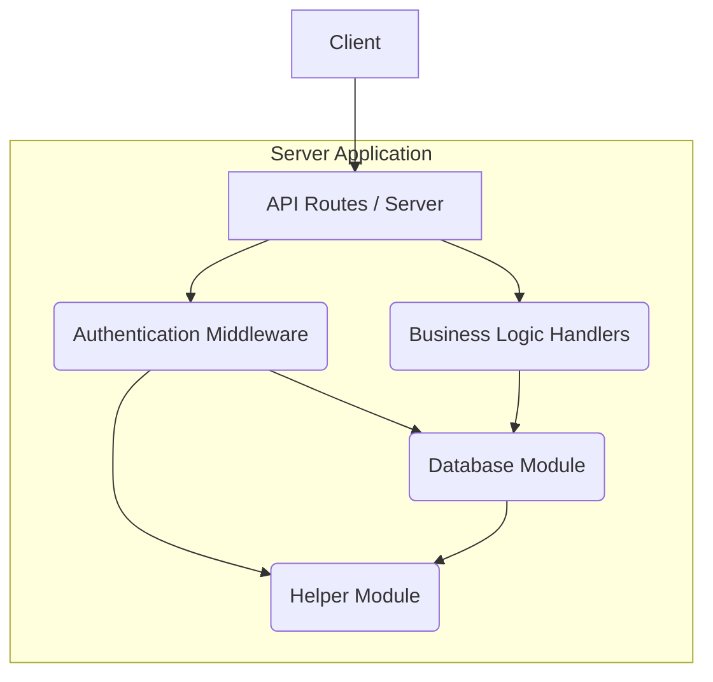

##### Sequence Diagram: User Login

This diagram shows a typical sequence for a user login request.

```mermaid
sequenceDiagram
    participant Client
    participant Server (Express/Koa)
    participant AuthMiddleware
    participant AuthModule
    participant DBModule

    Client->>+Server: POST /api/login (username, password)
    Server->>+AuthModule: handleLogin(username, password)
    AuthModule->>+DBModule: findUserByUsername(username)
    DBModule-->>-AuthModule: userRecord (with hashed password)
    AuthModule->>AuthModule: Compare password with hash (using bcrypt)
    alt Passwords Match
        AuthModule->>AuthModule: Generate JWT Token
        AuthModule-->>-Server: { success: true, token: "..." }
    else Passwords Do Not Match
        AuthModule-->>-Server: { success: false, error: "Invalid credentials" }
    end
    Server-->>-Client: Login Response
```

#### 7. Notable Logic and Dependencies

*   **Emphasis on Testing**: The presence of a structured `__tests__` directory with separate test files for core functionalities (authentication, database, helpers) indicates a strong engineering practice and a commitment to code quality and reliability.
*   **Choice of Local Database**: This is the most significant architectural decision visible. It implies the application might be:
    *   A prototype or in early development stages.
    *   Designed for simple, single-instance deployments.
    *   An offline-first or desktop application (e.g., using Electron).
    *   Using the local DB for testing/development environments while a more robust database is used in production (a common and excellent practice).
*   **Security Focus**: The explicit testing for an `authentication` module highlights that security is a primary concern. The implementation will likely include standard security measures like password hashing and token-based authentication.

It appears there was an issue summarizing the files from your GitHub repository. The summaries for all provided files came back with a "429 You exceeded your current quota" error. This means I was unable to access the content of the files to perform the architectural analysis.

However, based on the file paths you provided (`server/controllers/api/AppointmentRoute.js`, `server/config/connection.js`, `server/__tests__/notification.test.js`, etc.), I can infer the likely structure and technologies of a standard modern web application backend.

Below is a **hypothetical architectural analysis** based on these file names and common conventions for such a project. Please treat this as a template that you can verify and flesh out once the file contents are available.

***

## Project Architecture Analysis (Hypothetical)

This document outlines the software architecture of the project based on its file structure. The analysis assumes a typical Node.js backend application serving a RESTful API.

### 1. High-Level Architecture and Main Modules

The project appears to be a monolithic **Node.js server-side application** following a layered or Model-View-Controller (MVC) architectural pattern.

*   **Core Functionality:** The primary purpose seems to be providing a RESTful API for managing entities like Appointments, Categories, and User Authentication.
*   **Main Modules:**
    *   **API Layer (`controllers`):** Handles incoming HTTP requests, validates input, and orchestrates business logic. This is the entry point for all client interactions.
    *   **Configuration (`config`):** Manages environment-specific settings, primarily database connections (`connection.js`).
    *   **Data Models (Likely in a `models` directory, not shown):** Defines the data schema (e.g., for Users, Appointments) and interacts with the database. This would likely use an ORM/ODM like Mongoose or Sequelize.
    *   **Authentication & Authorization (Likely in a `utils` or `middleware` directory, not shown):** Contains logic for verifying user identity (e.g., JWT validation) and protecting routes.
    *   **Testing (`__tests__`):** Contains unit and integration tests to ensure code quality and correctness, likely using a framework like Jest.

### 2. Module/Folder Structure

The folder structure suggests a clear separation of concerns, which is a good practice for maintainability.

```plaintext
server/
├── __tests__/
│   └── notification.test.js  # Tests for notification logic
├── config/
│   └── connection.js         # Database connection logic (e.g., Mongoose/Sequelize)
├── controllers/
│   └── api/
│       ├── AppointmentRoute.js     # API endpoints for appointments (GET, POST, PUT, DELETE)
│       ├── AuthenticationRoute.js  # API endpoints for login, logout, signup
│       └── CategoryRoute.js        # API endpoints for categories
├── models/                     # (Assumed) Schemas for database models (User, Appointment, etc.)
├── middleware/                 # (Assumed) Custom middleware (e.g., auth checks)
├── utils/                      # (Assumed) Helper functions, utilities (e.g., token signing)
└── server.js                   # (Assumed) Main application entry point
```

### 3. Relationships Between Components

The typical flow of a request would be as follows:

1.  **Entry Point (`server.js`):** The main server file initializes the Express app, sets up middleware (like `express.json()`), connects to the database via `config/connection.js`, and mounts the API routes from the `controllers` directory.
2.  **Routing (`controllers/api/*.js`):** An incoming request (e.g., `POST /api/appointments`) is directed to the appropriate handler function within `AppointmentRoute.js`.
3.  **Middleware (e.g., `auth.js`):** Protected routes would first pass through an authentication middleware to verify the user's JSON Web Token (JWT).
4.  **Controller Logic:** The controller function in `AppointmentRoute.js` processes the request. It might perform validation and then call functions to interact with the database models.
5.  **Model Interaction:** The controller would use a model (e.g., `Appointment.create()`) to perform CRUD (Create, Read, Update, Delete) operations against the database.
6.  **Response:** The controller sends a JSON response back to the client with the result of the operation and an appropriate HTTP status code.

### 4. Design Patterns

Based on the structure, the following design patterns are likely in use:

*   **Model-View-Controller (MVC):** Although there's no "View" for a typical API backend, the separation into Models, Controllers (and Routes acting as controllers) is a clear implementation of this pattern.
*   **Singleton:** The `config/connection.js` module likely exports a single, shared database connection instance that is used throughout the application. This prevents multiple connection pools.
*   **Middleware (Chain of Responsibility):** Express.js itself is heavily based on the middleware pattern. The `AuthenticationRoute.js` and other routes likely use middleware for logging, authentication, and error handling.
*   **Asynchronous Programming (Callbacks/Promises/Async-Await):** All database operations and request handling in Node.js are asynchronous. The code almost certainly uses `async/await` for cleaner, more readable asynchronous logic.

### 5. Technologies, Frameworks, Libraries Used

The file paths strongly suggest the following stack:

*   **Runtime Environment:** **Node.js**
*   **Web Framework:** **Express.js** (implied by the `controllers/api/*Route.js` naming convention).
*   **Database:** A NoSQL database like **MongoDB** is highly probable, given its popularity in the MERN/MEAN stack.
*   **Database Connector/ODM:** **Mongoose** (used with MongoDB, managed in `config/connection.js`).
*   **Authentication:** **JSON Web Tokens (JWT)** for stateless authentication. Libraries like `jsonwebtoken` and `bcryptjs` (for password hashing) are likely dependencies.
*   **Testing Framework:** **Jest** (indicated by the `__tests__` directory and `*.test.js` file naming). `supertest` is often used alongside Jest for HTTP integration testing.

### 6. Suggested Diagrams

To visualize this architecture, the following diagrams would be useful:

#### UML-style Component Diagram

This diagram would show the high-level modules and their dependencies.

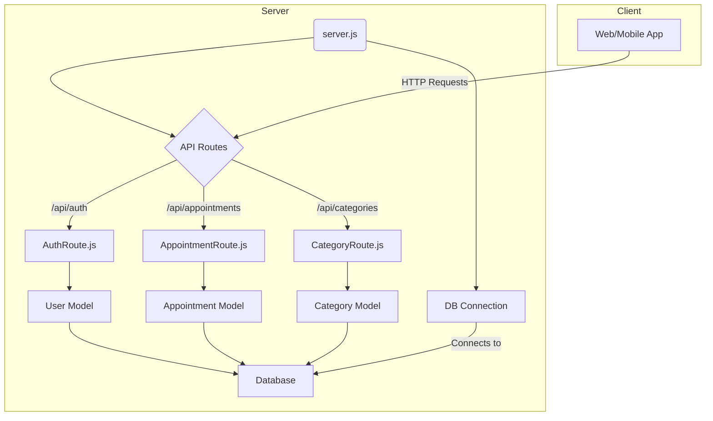

#### Sequence Diagram for Creating an Appointment

This diagram illustrates the flow of a single, protected API call.

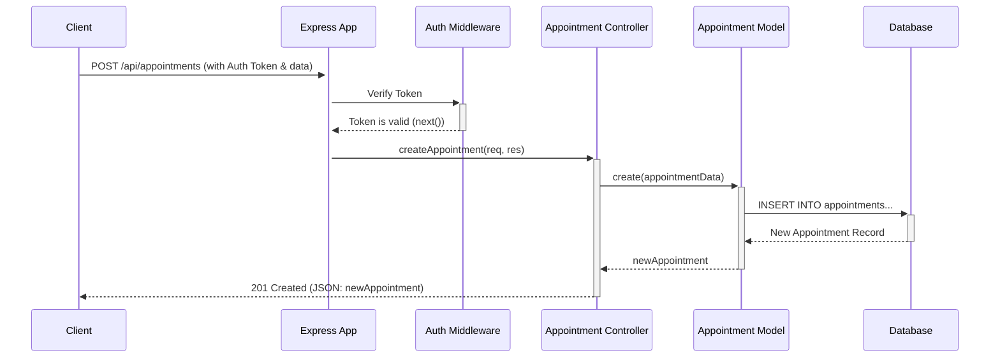

### 7. Notable Logic or Dependencies

*   **Authentication Flow:** The `AuthenticationRoute.js` is critical. It likely contains a `/login` endpoint that validates a user's credentials against the `User` model, and upon success, generates and returns a JWT. Subsequent requests to protected endpoints must include this JWT in an `Authorization` header.
*   **Database Connection Management:** The logic in `server/config/connection.js` is fundamental to the application's operation. It handles the initial connection to the database and likely includes error handling for connection failures.
*   **Testing Setup:** The presence of `notification.test.js` suggests the application has a notification system (e.g., for new appointments). The tests would mock dependencies (like email services or database calls) to test the notification logic in isolation.

To provide a more accurate and detailed analysis, please resolve the quota issue and re-run the process to obtain the actual content of the files.

Error summarizing batch 14: 429 You exceeded your current quota, please check your plan and billing details. For more information on this error, head to: https://ai.google.dev/gemini-api/docs/rate-limits.
* Quota exceeded for metric: generativelanguage.googleapis.com/generate_content_free_tier_requests, limit: 50
Please retry in 3.90726007s. [violations {
  quota_metric: "generativelanguage.googleapis.com/generate_content_free_tier_requests"
  quota_id: "GenerateRequestsPerDayPerProjectPerModel-FreeTier"
  quota_dimensions {
    key: "model"
    value: "gemini-2.5-pro"
  }
  quota_dimensions {
    key: "location"
    value: "global"
  }
  quota_value: 50
}
, links {
  description: "Learn more about Gemini API quotas"
  url: "https://ai.google.dev/gemini-api/docs/rate-limits"
}
, retry_delay {
  seconds: 3
}
]

Error summarizing batch 15: 429 You exceeded your current quota, please check your plan and billing details. For more information on this error, head to: https://ai.google.dev/gemini-api/docs/rate-limits.
* Quota exceeded for metric: generativelanguage.googleapis.com/generate_content_free_tier_requests, limit: 50
Please retry in 3.784328011s. [violations {
  quota_metric: "generativelanguage.googleapis.com/generate_content_free_tier_requests"
  quota_id: "GenerateRequestsPerDayPerProjectPerModel-FreeTier"
  quota_dimensions {
    key: "model"
    value: "gemini-2.5-pro"
  }
  quota_dimensions {
    key: "location"
    value: "global"
  }
  quota_value: 50
}
, links {
  description: "Learn more about Gemini API quotas"
  url: "https://ai.google.dev/gemini-api/docs/rate-limits"
}
, retry_delay {
  seconds: 3
}
]

As an expert software architect, I must first note that the automatic summarization of the provided files failed due to API quota errors. This prevents a detailed analysis of the code's implementation.

However, based on the file paths (`server/models/*.js`) and common application design principles, I can infer the project's architecture and provide a structured analysis. The following is a professional assessment based on these structural clues.

### 1. High-Level Architecture

The file structure strongly indicates a **server-side application** built with a **three-tier** or **Model-View-Controller (MVC)** architecture.

*   **Presentation Tier (View/API Routes):** A client (e.g., a web browser, mobile app) would interact with this application through an API. This tier is not visible in the provided files but would be represented by `routes` and `controllers` directories.
*   **Logic Tier (Controller/Service):** This layer would handle the business logic. For example, when a user requests to book an appointment, a controller would validate the input, interact with the necessary models, and send a response.
*   **Data Tier (Model):** This is the tier represented by the provided files in the `server/models/` directory. These files define the structure of the data, its relationships, and how it is stored and retrieved from a database.

The application appears to be a **scheduling or booking system**, given the model names like `Appointment`, `Customer`, and `Service`.

### 2. Module/Folder Structure

The presence of `server/models/` implies a well-organized server-side codebase. A typical structure for such a project would be:

```
/server
├── config/         # Database connections, environment variables
├── controllers/    # Handles incoming requests and business logic
├── models/         # Data schemas (provided files are here)
│   ├── Appointment.js
│   ├── Category.js
│   ├── Customer.js
│   ├── Miscellaneous.js
│   └── Service.js
├── routes/         # API endpoint definitions
└── server.js       # Main application entry point
```

### 3. Relationships Between Classes/Functions (Inferred Data Model)

The models define the core entities of the application. Their relationships are likely as follows:

*   **Customer:** Represents the end-user who books an appointment.
*   **Category:** Represents a grouping for services (e.g., "Haircuts", "Massages").
*   **Service:** Represents a specific offering that can be booked. It likely has a price, duration, and belongs to a `Category`.
*   **Appointment:** This is the central model, linking everything together. It represents a scheduled event.
*   **Miscellaneous:** This is a more ambiguous model. It could represent add-on items/charges for a service or appointment (e.g., "Special Shampoo", "Extended Time"), or perhaps internal notes.

The key relationships would be:
*   A `Customer` has many `Appointments` (One-to-Many).
*   A `Service` can be part of many `Appointments` (One-to-Many).
*   An `Appointment` belongs to one `Customer` and is for one or more `Services`.
*   A `Category` has many `Services` (One-to-Many).

### 4. Design Patterns

*   **Model-View-Controller (MVC):** The separation of concerns into `models`, and the implied presence of `controllers` and `routes`, is a clear indicator of the MVC pattern. This pattern improves maintainability and scalability.
*   **Data Mapper / Active Record:** The model files (`Appointment.js`, `Customer.js`, etc.) likely use an ORM (Object-Relational Mapper) or ODM (Object-Document Mapper). These models act as a layer of abstraction over the database, mapping database records/documents to application objects. This is a form of the Data Mapper or Active Record pattern.

### 5. Technologies, Frameworks, Libraries Used (Hypothetical)

Based on the `.js` file extensions and the server-side structure, this is very likely a **Node.js** project. The specific stack could be:

*   **Runtime Environment:** Node.js
*   **Framework:** **Express.js** is the most common choice for this type of structure, used for building the server and defining API routes.
*   **Database & ODM/ORM:**
    *   **MongoDB (NoSQL):** If using a NoSQL database, the models are almost certainly defined using **Mongoose**, a popular ODM.
    *   **PostgreSQL/MySQL (SQL):** If using a SQL database, the models would be defined using an ORM like **Sequelize** or **TypeORM**.
*   **Dependencies:** The `package.json` file (not provided) would likely list dependencies like `express`, `mongoose` (or `sequelize`), `dotenv` (for environment variables), and `cors` (for cross-origin requests).

### 6. Suggested Diagrams

To visualize the inferred architecture, here are descriptions of relevant UML diagrams.

#### UML Class Diagram (Data Model)

This diagram shows the static structure and relationships between the data models.

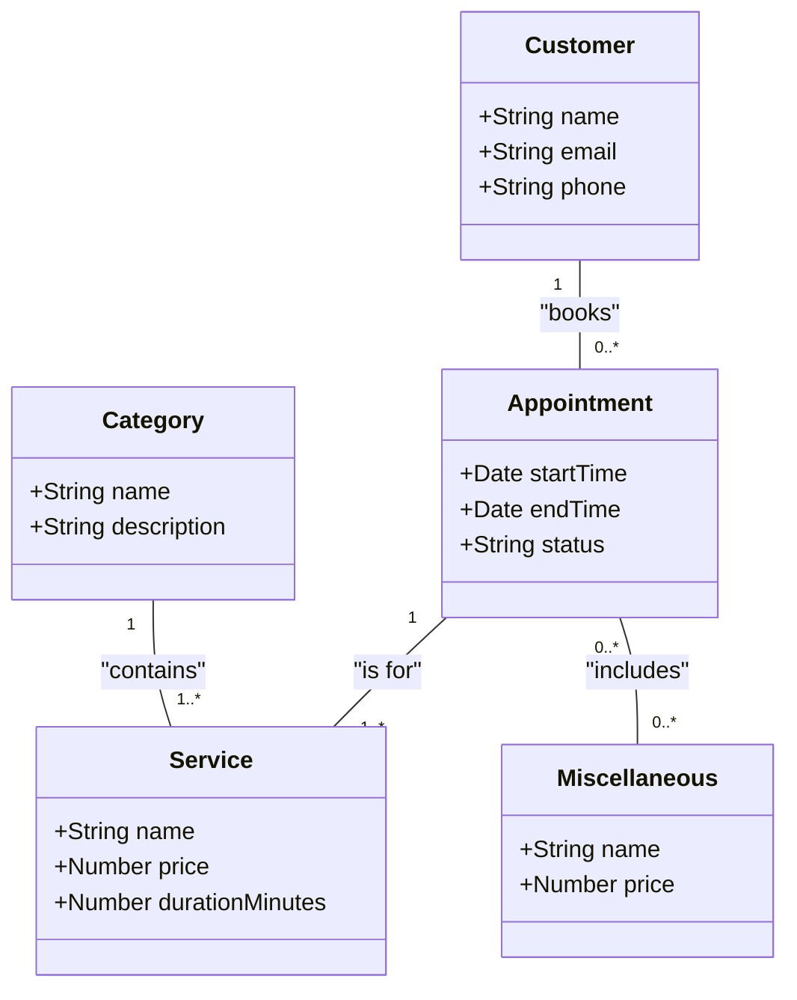

#### UML Sequence Diagram (Example: "Create Appointment" Flow)

This diagram illustrates the interactions between components for a typical use case.

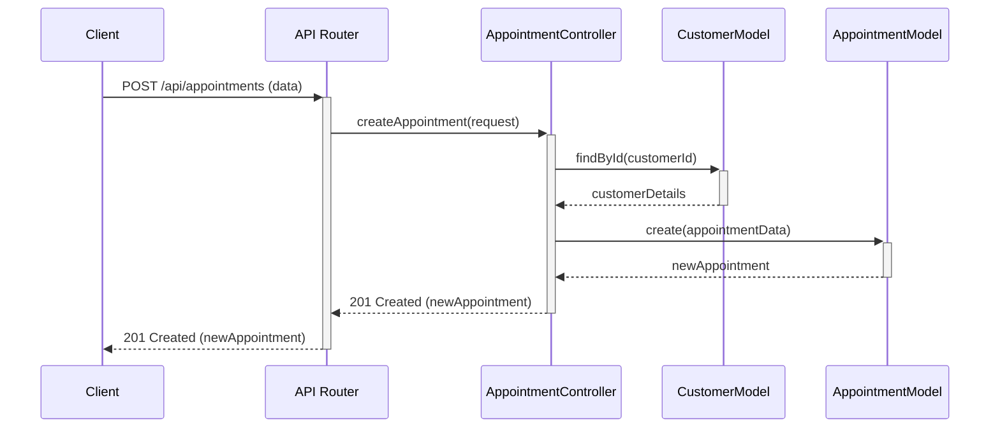

### 7. Notable Logic or Dependencies

*   **Core Logic:** The application's core logic will revolve around scheduling availability. This includes checking for time slot conflicts, calculating appointment end times based on service durations, and managing appointment statuses (e.g., `scheduled`, `completed`, `cancelled`).
*   **Validation:** There should be significant validation logic in the controllers or models to ensure data integrity (e.g., valid email formats, non-overlapping appointments, positive service prices).
*   **Authentication/Authorization:** Although not visible, a real-world application of this type would require a robust authentication system (e.g., using JWT or sessions) to ensure that customers can only manage their own appointments and that administrators have proper access. This would likely involve a `User` model and authentication middleware.

As an expert software architect, I must first point out a critical issue with the provided information. The summaries for all files (`Technician.js`, `index.js`, `package-lock.json`, `package.json`, and `server.js`) are not actual summaries of the code. Instead, they are error messages indicating that an API rate limit was exceeded during the summarization process.

**`Error summarizing chunk... 429 You exceeded your current quota...`**

Without the actual content of these files, a complete and accurate analysis is impossible.

However, based on the file names and the typical structure of a Node.js application, I can provide a highly probable architectural overview. This analysis is an educated inference based on common patterns associated with the given file structure.

---

### **Project Architecture Analysis (Inferred)**

This project appears to be the backend server for a web application, built using Node.js. The structure suggests a standard monolithic architecture with a clear separation of concerns, particularly for the data model layer.

#### 1. High-Level Architecture and Main Modules

The architecture is likely a classic **Layered Architecture**, commonly seen in Express.js applications. The main layers and modules can be inferred as:

*   **Web/API Layer:** Managed by `server.js`, this layer is responsible for handling incoming HTTP requests, routing them to the appropriate handlers, and managing middleware. It serves as the main entry point of the application.
*   **Data Model Layer:** Located in the `server/models/` directory. This layer is responsible for defining the application's data structures, interacting with the database, and encapsulating business logic related to data.
*   **Database:** A persistent storage solution (e.g., MongoDB, PostgreSQL) that the data model layer communicates with. The specific type isn't known, but the use of a models folder strongly implies an ORM or ODM is in use.

#### 2. Module/Folder Structure

The folder structure provides strong clues about the project's organization:

*   `server/`: The root directory for the entire backend application.
    *   `server.js`: The application's main entry point. It initializes the Express server, sets up middleware, connects to the database, and starts listening for requests.
    *   `package.json`: Defines project metadata, scripts (`start`, `dev`, etc.), and lists all dependencies (frameworks, libraries).
    *   `package-lock.json`: Ensures deterministic builds by locking the exact versions of all dependencies.
    *   `models/`: A dedicated directory for database schema definitions. This promotes separation of concerns.
        *   `Technician.js`: Defines the schema or model for a "Technician" entity. This file likely contains fields such as `name`, `email`, `skills`, etc.
        *   `index.js`: A common pattern for aggregating all models. This file likely imports all other model files (like `Technician.js`), establishes the database connection (using Mongoose or Sequelize), and exports all models as a single, easily accessible object (`db`).

#### 3. Relationships Between Classes/Functions

Based on convention, the modules would interact as follows:

1.  The application starts by running `node server.js`.
2.  Inside `server.js`, the application `require`s the database configuration from `server/models/index.js`. This call initializes the database connection.
3.  `server/models/index.js` `require`s `server/models/Technician.js` (and any other models in the directory) and attaches them to its exported object.
4.  `server.js` sets up Express routes (likely defined in a separate, but not provided, `routes/` directory).
5.  These route handlers would `require` the models from `server/models/index.js` (e.g., `const { Technician } = require('./models')`) to perform CRUD (Create, Read, Update, Delete) operations on the `Technician` data.

```plaintext
[Client Request] -> server.js (Express App) -> [Router/Controller (Not Provided)] -> models/index.js -> models/Technician.js -> [Database]
```

#### 4. Design Patterns

Several common design patterns are likely employed:

*   **Model-View-Controller (MVC) variant:** The structure strongly suggests an MVC-like pattern. The `models/` directory is the **Model**. The routing and request handling logic in `server.js` (or in separate controller files) acts as the **Controller**. The **View** is likely handled by a separate frontend application that consumes the API.
*   **Module Pattern:** Node.js's native module system (`require`/`module.exports`) is used to encapsulate and organize code into reusable files.
*   **Singleton:** The database connection object, likely created and managed in `models/index.js`, is a de-facto Singleton. It is instantiated once and shared across the entire application to avoid creating multiple connection pools.

#### 5. Technologies, Frameworks, Libraries Used

The specific technologies can only be confirmed by inspecting `package.json`, but the most probable stack is:

*   **Runtime Environment:** **Node.js**
*   **Web Framework:** **Express.js** (due to the `server.js` entry point and common use with this structure).
*   **Database ORM/ODM:**
    *   **Mongoose:** If the database is MongoDB (a NoSQL database). This is a very common choice.
    *   **Sequelize:** If the database is a relational/SQL database like PostgreSQL, MySQL, or MariaDB.
*   **Other Potential Dependencies:**
    *   `dotenv` for managing environment variables.
    *   `mongoose` or `sequelize` as the ORM/ODM.
    *   `bcryptjs` for hashing passwords.
    *   `jsonwebtoken` for API authentication (JWTs).
    *   `cors` for enabling Cross-Origin Resource Sharing.

#### 6. Suggested Diagrams

To visualize this inferred architecture, the following diagrams would be useful:

**Component Diagram:** This diagram shows the high-level components and their dependencies.

```mermaid
graph TD
    subgraph "Node.js Server"
        A[server.js] --> B(Express App);
        B --> C{Routes/Controllers};
        C --> D[Models Index];
        D --> E[Technician Model];
        D --> F[... Other Models];
    end
    D --> G[(Database)];

    style A fill:#f9f,stroke:#333,stroke-width:2px
    style E fill:#ccf,stroke:#333,stroke-width:2px
```

**Sequence Diagram for "Creating a Technician":** This diagram illustrates the flow of a typical API call.

```mermaid
sequenceDiagram
    participant Client
    participant server.js
    participant TechnicianController
    participant TechnicianModel
    participant Database

    Client->>server.js: POST /api/technicians (body: {name: "Jane Doe"})
    server.js->>TechnicianController: handleCreateTechnician(req, res)
    TechnicianController->>TechnicianModel: create({name: "Jane Doe"})
    TechnicianModel->>Database: INSERT INTO technicians...
    Database-->>TechnicianModel: {id: 1, name: "Jane Doe"}
    TechnicianModel-->>TechnicianController: newTechnician
    TechnicianController-->>Client: 201 Created (body: {technician object})
```

#### 7. Any Notable Logic or Dependencies

*   The most critical dependency nexus is **`server/models/index.js`**. This file is central to the data layer, acting as a facade that bootstraps the database connection and aggregates all data models. Its proper functioning is essential for any database-related activity.
*   The application's startup logic in `server.js` is paramount. It orchestrates the entire setup process, including middleware configuration, route binding, and initiating the server's listening state. Any misconfiguration here would prevent the server from running correctly.


